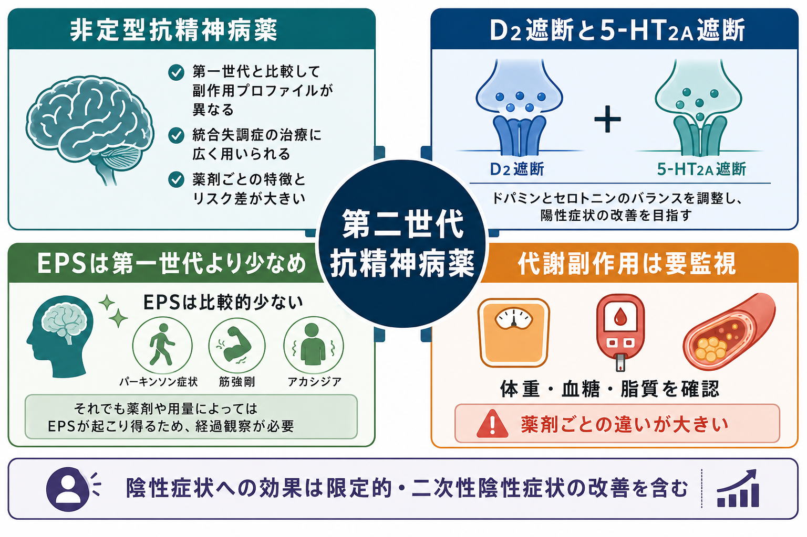
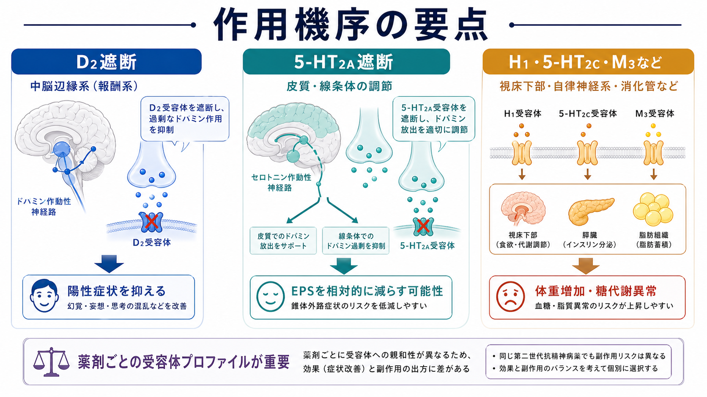
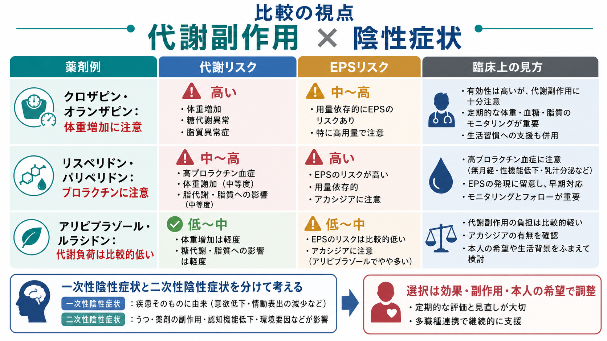

# 第二世代抗精神病薬とは何か

## 要点

- 第二世代抗精神病薬は「非定型抗精神病薬」とも呼ばれ、主に統合失調症などの精神病症状に用いられる[[抗精神病薬とは何か|抗精神病薬]]の一群である。
- 共通項は、ドパミン D2 受容体遮断に加えて、セロトニン 5-HT2A 受容体遮断などをもつ点にある。ただし、受容体プロファイルは薬剤ごとに大きく異なる[1][2]。
- 第一世代抗精神病薬より錐体外路症状が少ない傾向がある一方、体重増加、糖代謝異常、脂質異常などの代謝副作用が重要になる[3][4]。
- 陰性症状への効果は「強い特異的効果」と単純化できない。二次性陰性症状、すなわち陽性症状、抑うつ、薬剤性パーキンソニズム、鎮静などに伴う陰性症状が改善する場合を分けて考える必要がある[6][7]。
- この記事は教育・研究目的の整理であり、個別の処方選択や変更を指示するものではない。

## この記事で答える問い

1. 第二世代抗精神病薬は、第一世代抗精神病薬と何が違うのか。
2. なぜ「D2 遮断 + 5-HT2A 遮断」と説明されるのか。
3. 代謝副作用はどの薬剤で、なぜ重要になるのか。
4. 「陰性症状に効く」という説明はどこまで正確か。
5. 臨床で薬剤を考えるとき、効果と副作用をどう見取り図化すればよいか。

## まず結論

第二世代抗精神病薬は、第一世代抗精神病薬より「新しい」「安全」という意味ではなく、受容体作用と副作用の出方が異なる抗精神病薬群である。中心にあるのは D2 受容体遮断による抗精神病作用だが、5-HT2A 受容体遮断、H1、5-HT2C、M3、α1、D2 部分作動などの違いによって、鎮静、体重増加、糖代謝異常、高プロラクチン血症、錐体外路症状のリスクが薬剤ごとに変わる[1][3][4]。

したがって、第二世代抗精神病薬を理解する軸は「第一世代よりよい薬」ではなく、「陽性症状への効果」「錐体外路症状」「代謝副作用」「高プロラクチン血症」「鎮静」「本人の希望と生活機能」を同時に見ることである。これは[[薬物療法のリスクベネフィットをどう考えるか|薬物療法のリスクベネフィット]]の典型例でもある。

## 背景

抗精神病薬は、1950年代以降、精神病症状の治療を大きく変えた。初期の薬剤は陽性症状に有効である一方、パーキンソニズム、アカシジア、ジストニア、遅発性ジスキネジアなどの[[抗精神病薬の錐体外路症状とは何か|錐体外路症状]]が問題になりやすかった[2][3]。

第二世代抗精神病薬は、この限界への応答として位置づけられてきた。代表的にはクロザピン、リスペリドン、オランザピン、クエチアピン、アリピプラゾール、パリペリドン、ルラシドンなどが含まれる。ただし、これらを一括して「副作用が少ない」と見るのは不正確である。大規模なネットワークメタ解析では、薬剤間で有効性、脱落、錐体外路症状、鎮静、体重増加、プロラクチン上昇などに差があることが示されている[3]。

## 基本概念

### 第二世代抗精神病薬

第二世代抗精神病薬とは、第一世代抗精神病薬と比べて、強い D2 遮断だけでは説明しきれない薬理作用と副作用プロファイルをもつ抗精神病薬群である。臨床では「非定型抗精神病薬」と呼ばれることも多い。

典型的な説明は、D2 受容体遮断に 5-HT2A 受容体遮断が加わる、というものである。D2 遮断は中脳辺縁系の過剰なドパミン作用を抑え、幻覚や妄想などの陽性症状を軽減する方向に働く。一方、5-HT2A 遮断は皮質や線条体のドパミン放出に影響し、錐体外路症状の出方を相対的に変えると説明される[1][2]。

ただし、この説明は入口であって全体ではない。クロザピンとオランザピンは代謝副作用が目立ちやすく、リスペリドンとパリペリドンは高プロラクチン血症や用量依存的な錐体外路症状が問題になりやすい。アリピプラゾールは D2 部分作動薬としての性質をもち、アカシジアに注意する[3][4]。

### 第一世代との違い

第一世代抗精神病薬と第二世代抗精神病薬の違いは、世代名よりも「副作用の重心」で理解した方がよい。第一世代、とくに高力価薬では錐体外路症状が問題になりやすい。第二世代では錐体外路症状は相対的に少ない傾向があるが、代謝副作用、鎮静、プロラクチン上昇などが薬剤ごとに重要になる[3][4]。

レヴューとメタ解析は、第二世代全体が第一世代全体に一律で優越するというより、薬剤ごとの有効性と副作用の差を見た選択が必要であることを示している[3][5]。これは[[精神科薬物療法とは何か|精神科薬物療法]]を「疾患名に薬を当てる作業」ではなく、症状、リスク、本人の生活、モニタリングを統合する作業として見る理由でもある。

## 仕組み

### D2遮断と抗精神病作用

抗精神病作用の中核は、ドパミン D2 受容体への作用である。中脳辺縁系の過剰なドパミン信号は、妄想、幻覚、異常なサリエンス付与と関連づけて説明されることが多い。D2 受容体遮断はこの過剰な信号を抑える方向に働く[1][2]。

しかし、D2 遮断が強すぎる、または線条体での作用が大きくなると、運動制御への影響として錐体外路症状が起こりうる。ここに、第二世代抗精神病薬で「D2 だけではなく 5-HT2A も見る」理由がある。

### 5-HT2A遮断と副作用プロファイル

5-HT2A 遮断は、線条体や皮質でのドパミン放出を調整し、D2 遮断に伴う錐体外路症状を相対的に減らす可能性があると説明される。ただし、実際の EPS リスクは薬剤、用量、年齢、併存症、併用薬、過去の副作用歴で変わる[3]。

さらに、第二世代抗精神病薬の臨床像は 5-HT2A だけでは決まらない。H1 受容体や 5-HT2C 受容体、M3 受容体への作用は、食欲増加、体重増加、糖代謝異常、脂質異常と関連して考えられる。代謝副作用は、単なる「体重が増える副作用」ではなく、糖尿病、脂質異常、心血管リスクを含む長期的な身体リスクとして扱う必要がある[4][8]。

## 図解

第二世代抗精神病薬を臨床的に見取るときは、少なくとも次の三つを並べると理解しやすい。

| 視点 | 何を見るか | 代表的な注意点 |
|---|---|---|
| 抗精神病作用 | 陽性症状、興奮、再発予防 | 効果は薬剤・用量・服薬継続で変わる |
| 運動系副作用 | パーキンソニズム、アカシジア、ジストニア、遅発性ジスキネジア | 第二世代でも起こりうる |
| 身体代謝 | 体重、腹囲、血糖、HbA1c、脂質、血圧 | クロザピン、オランザピンなどで特に注意 |

## 臨床・研究との接続

### 代謝副作用をどう扱うか

第二世代抗精神病薬の理解で最も実務的に重要なのは、[[抗精神病薬の代謝副作用とは何か|代謝副作用]]である。とくにクロザピンとオランザピンは、体重増加や脂質・糖代謝への影響が大きい薬剤として繰り返し報告されている[4]。一方で、アリピプラゾール、ルラシドン、ジプラシドンなどは相対的に代謝負荷が低い傾向があるが、「ない」とは言えない[4]。

NICE は、抗精神病薬の開始前に体重、ウエスト周囲径、血圧、空腹時血糖または HbA1c、脂質、プロラクチン、運動障害評価などを確認し、開始後も継続的に身体モニタリングを行うことを推奨している[8]。これは薬を避けるためではなく、効果を得ながら副作用を早く見つけ、生活支援と医学的対応を組み合わせるためである。

### 陰性症状への効果をどう読むか

第二世代抗精神病薬は、しばしば「陰性症状にも効く」と説明される。しかし、この表現は注意が必要である。陰性症状には、意欲低下、感情表出の乏しさ、会話量の低下、社会的引きこもりなどが含まれるが、その背景は一つではない[7]。

重要なのは、一次性陰性症状と二次性陰性症状を分けることである。一次性陰性症状は疾患過程そのものに近い症状であり、薬剤で大きく改善するとは限らない。二次性陰性症状は、陽性症状、抑うつ、不安、鎮静、錐体外路症状、社会的孤立などにより「陰性症状のように見える」状態である。第二世代抗精神病薬が陰性症状を改善するように見える場合、その一部は二次性陰性症状の改善を反映している可能性がある[6][7]。

したがって、陰性症状を評価するときは「薬を増やすか」だけでなく、過鎮静、パーキンソニズム、抑うつ、睡眠、生活リズム、社会的機会、認知機能を同時に見る必要がある。

### 薬剤選択は「世代」ではなく「個別プロファイル」

薬剤選択では、世代名よりも個別薬剤のプロファイルを見る。たとえば、代謝リスクが高い人にオランザピンを使う場合は、効果の見込みと代謝モニタリング計画を明確にする必要がある。高プロラクチン血症が問題になりやすい人では、[[高プロラクチン血症とは何か|プロラクチン関連症状]]を確認する。アカシジアが出やすい人では、アリピプラゾールなどでも焦燥や落ち着かなさを丁寧に評価する。

研究上も、第二世代抗精神病薬は単一カテゴリではなく、薬剤ごとの有効性、受容性、副作用を比較する対象になっている。大規模ネットワークメタ解析は、薬剤間の差を「平均的な群差」ではなく、複数アウトカムのバランスとして読む必要があることを示している[3][4]。

## よくある誤解

### 誤解1: 第二世代は第一世代より常に安全である

安全性の種類が違う。第二世代では錐体外路症状が少ない傾向はあるが、代謝副作用、鎮静、プロラクチン上昇、心電図変化などが薬剤ごとに問題になる[3][4]。

### 誤解2: 非定型抗精神病薬なら陰性症状に効く

陰性症状の改善は、一次性陰性症状への直接効果と、二次性陰性症状の改善を分けて読む必要がある。陽性症状や EPS、抑うつ、鎮静が改善すれば、活動性や表情が改善したように見えることがある[6][7]。

### 誤解3: 代謝副作用は太るかどうかだけの問題である

代謝副作用は、体重、腹囲、血糖、HbA1c、脂質、血圧、脂肪肝、糖尿病、心血管リスクまで含む身体医学的問題である。開始前と開始後のモニタリングが治療の一部になる[4][8]。

### 誤解4: 受容体作用がわかれば薬剤選択は決まる

受容体作用は重要だが、薬剤選択はそれだけでは決まらない。過去の反応、再発歴、服薬継続可能性、副作用への許容度、身体疾患、妊娠可能性、費用、本人の希望、家族・支援体制を含めて考える必要がある[8]。

## 関連ノート

- [[抗精神病薬とは何か]]
- [[抗精神病薬の代謝副作用とは何か]]
- [[抗精神病薬の錐体外路症状とは何か]]
- [[高プロラクチン血症とは何か]]
- [[精神科薬物療法とは何か]]
- [[薬物療法のリスクベネフィットをどう考えるか]]
- [[向精神薬の基本分類とは何か]]
- [[薬剤性精神症状とは何か]]

MOC更新候補: `content/00_MOC/MOC｜臨床実践・治療.md`、`content/00_MOC/MOC｜精神医学.md`。並列ジョブとの衝突を避けるため、本記事からは MOC を直接更新していない。

## 理解チェック

1. 第二世代抗精神病薬を「D2 遮断 + 5-HT2A 遮断」と説明するとき、どの点が有用で、どの点が単純化になりすぎるか。
2. クロザピンやオランザピンで代謝モニタリングが重要になる理由を、体重以外の指標も含めて説明できるか。
3. 「陰性症状が改善した」と見える場合、一次性陰性症状と二次性陰性症状をどう区別して考えるか。
4. 第二世代抗精神病薬でも錐体外路症状が起こりうる場面を挙げられるか。
5. 薬剤選択で、効果・副作用・本人の希望を同時に扱うとは具体的に何を確認することか。

## 未解決問題

- 一次性陰性症状に対する薬物療法の効果を、二次性陰性症状の改善からどこまで分離して評価できるか。
- 代謝副作用のリスクを、遺伝、生活習慣、既往歴、薬剤プロファイルからどこまで個別予測できるか。
- 再発予防、生活機能、認知機能、身体リスクを同時に最適化する薬剤選択モデルをどう作るか。
- 長期使用時の有効性と副作用を、短期 RCT と実臨床データからどう統合して判断するか。

## 参考文献

[1] Miyamoto, S., Duncan, G. E., Marx, C. E., & Lieberman, J. A. (2005). Treatments for schizophrenia: a critical review of pharmacology and mechanisms of action of antipsychotic drugs. *Molecular Psychiatry*, 10, 79-104. https://doi.org/10.1038/sj.mp.4001556

[2] Leucht, S., Corves, C., Arbter, D., Engel, R. R., Li, C., & Davis, J. M. (2009). Second-generation versus first-generation antipsychotic drugs for schizophrenia: a meta-analysis. *The Lancet*, 373(9657), 31-41. https://doi.org/10.1016/S0140-6736(08)61764-X

[3] Huhn, M., Nikolakopoulou, A., Schneider-Thoma, J., et al. (2019). Comparative efficacy and tolerability of 32 oral antipsychotics for the acute treatment of adults with multi-episode schizophrenia: a systematic review and network meta-analysis. *The Lancet*, 394(10202), 939-951. https://doi.org/10.1016/S0140-6736(19)31135-3

[4] Pillinger, T., McCutcheon, R. A., Vano, L., et al. (2020). Comparative effects of 18 antipsychotics on metabolic function in patients with schizophrenia, predictors of metabolic dysregulation, and association with psychopathology: a systematic review and network meta-analysis. *The Lancet Psychiatry*, 7(1), 64-77. https://doi.org/10.1016/S2215-0366(19)30416-X

[5] American Psychiatric Association. (2020). *The American Psychiatric Association Practice Guideline for the Treatment of Patients With Schizophrenia* (3rd ed.). https://doi.org/10.1176/appi.books.9780890424841

[6] Krause, M., Zhu, Y., Huhn, M., Schneider-Thoma, J., Bighelli, I., Chaimani, A., & Leucht, S. (2018). Antipsychotic drugs for patients with schizophrenia and predominant or prominent negative symptoms: a systematic review and meta-analysis. *European Archives of Psychiatry and Clinical Neuroscience*, 268, 625-639. https://doi.org/10.1007/s00406-018-0869-3

[7] Correll, C. U., & Schooler, N. R. (2020). Negative symptoms in schizophrenia: a review and clinical guide for recognition, assessment, and treatment. *Neuropsychiatric Disease and Treatment*, 16, 519-534. https://doi.org/10.2147/NDT.S225643

[8] National Institute for Health and Care Excellence. (2014, updated). *Psychosis and schizophrenia in adults: prevention and management* (NICE guideline CG178). https://www.nice.org.uk/guidance/cg178
