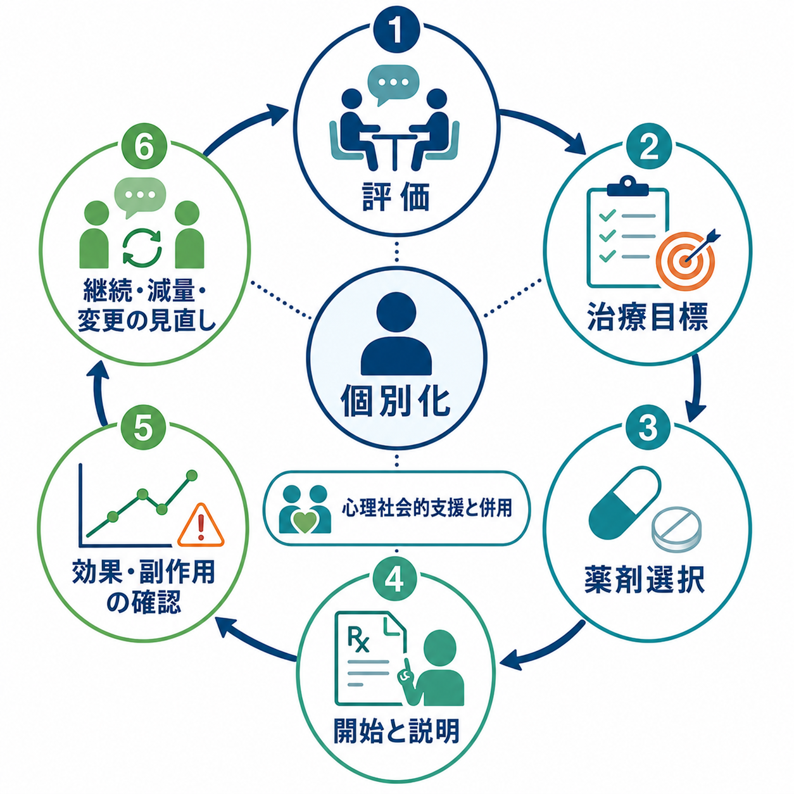
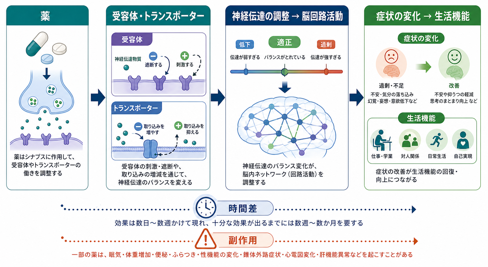

# 精神科薬物療法とは何か

## 要点

- 精神科薬物療法は、[[シナプスとは何か|シナプス]]、受容体、トランスポーター、細胞内シグナル、神経回路の活動を調整し、症状と生活機能の回復を支える治療である。
- 薬は「症状を消す物質」ではなく、本人の回復力、睡眠、環境調整、[[心理療法とは何か|心理療法]]、リハビリテーション、家族・地域支援と組み合わせて使う道具である。
- 効果は疾患、標的症状、薬剤、用量、服薬期間、併存症、身体疾患、相互作用、本人の価値観によって変わる。
- 臨床では、診断名だけでなく「何を改善したいのか」「どの副作用は避けたいのか」「いつ見直すのか」を明確にする。
- 本稿は教育・研究目的の概説であり、個別の診断、処方、減量、中止の指示ではない。

## この記事で答える問い

1. 精神科薬物療法は、脳と症状にどのように作用すると考えられるのか。
2. 抗うつ薬、抗精神病薬、気分安定薬、抗不安薬・睡眠薬は、どのような役割を持つのか。
3. 効果と副作用を、臨床ではどのように評価し続けるのか。
4. 「薬だけで治す」「化学的不均衡を単純に補正する」といった理解は、なぜ不十分なのか。

## まず結論

精神科薬物療法とは、精神症状に関わる神経伝達と[[脳内ネットワークとは何か|脳内ネットワーク]]の状態を、薬理学的に調整する治療である。対象は、抑うつ、不安、不眠、幻覚・妄想、躁状態、衝動性、注意困難、認知症周辺症状など幅広い。ただし、薬の作用点は分子やシナプスにあっても、治療の目標は血中濃度や受容体占有率そのものではなく、苦痛の軽減、再発予防、社会機能、本人が大切にする生活の回復である。

そのため、精神科薬物療法は「診断名に薬を当てはめる作業」ではない。実際には、[[鑑別診断とは何か|鑑別診断]]、身体疾患や薬剤性要因の確認、重症度評価、リスク評価、本人の希望、過去の反応、副作用の許容度を合わせて判断する。WHO mhGAP などの国際ガイドラインも、薬物療法を心理社会的介入、フォローアップ、教育、家族・地域資源と組み合わせる枠組みで位置づけている[1]。

## 背景

精神科薬物療法は、20世紀半ば以降、クロルプロマジン、リチウム、三環系抗うつ薬、ベンゾジアゼピンなどの登場によって急速に発展した。以後、選択的セロトニン再取り込み阻害薬、非定型抗精神病薬、抗てんかん薬由来の気分安定薬、認知症治療薬、ADHD治療薬などが加わり、臨床上の選択肢は増えた。

一方で、精神科薬物療法には限界もある。第一に、薬の平均効果は集団レベルで示されても、個人レベルでの反応はばらつく。第二に、副作用、相互作用、妊娠・授乳、高齢者、身体合併症、依存・離脱、過量服薬リスクなどを考慮する必要がある。第三に、精神疾患の病態は単一の神経伝達物質だけでは説明できず、発達、ストレス、学習、予測処理、社会環境、身体状態が重なって形成される。

したがって、薬物療法は「脳だけを見る治療」ではなく、[[ケースフォーミュレーションとは何か|ケースフォーミュレーション]]の一部として使う。薬が効いたかどうかも、症状尺度だけでなく、睡眠、食事、日中活動、対人関係、仕事・学業、再発兆候、本人の主観的負担を含めて評価する。

## 基本概念

### 標的症状

精神科薬物療法では、診断名よりも具体的な標的症状を明確にすることが重要である。たとえば「[[うつ病とは何か|うつ病]]だから抗うつ薬」ではなく、抑うつ気分、興味低下、不眠、食欲変化、不安、焦燥、希死念慮、疼痛、認知症状のどれをどの程度改善したいのかを整理する。[[統合失調症とは何か|統合失調症]]でも、幻覚・妄想、興奮、再発予防、陰性症状、認知機能、錐体外路症状への脆弱性は別々に考える必要がある。

### 薬効と副作用

薬効と副作用は別々のものに見えるが、どちらも薬が身体の受容体、酵素、イオンチャネル、トランスポーターなどに作用した結果である。抗精神病薬のD2受容体遮断は精神病症状の軽減に関係する一方、過度の遮断はパーキンソニズム、アカシジア、遅発性ジスキネジア、高プロラクチン血症などに関係しうる[5]。抗うつ薬でも、セロトニン・ノルアドレナリン系への作用が有益な方向に働く場合がある一方、消化器症状、眠気、性機能変化、賦活、不安増悪、離脱症状などが問題になることがある。

### アドヒアランスとコンコーダンス

精神科薬物療法では、薬を「飲むか飲まないか」だけでなく、本人が治療の意味を理解し、納得し、生活の中で続けられるかが重要である。[[アドヒアランスとは何か|アドヒアランス]]は服薬の継続性を指すが、現代的には、本人と治療者が治療目標や懸念をすり合わせる[[コンコーダンスとは何か|コンコーダンス]]や[[共同意思決定とは何か|共同意思決定]]が重視される。

## 仕組み

### シナプスから回路へ

多くの精神科薬は、[[神経伝達物質はどのように放出されるのか|神経伝達物質の放出]]、[[神経伝達物質はどのように除去されるのか|再取り込みや分解]]、[[受容体にはどのような種類があるのか|受容体]]刺激・遮断、イオンチャネル、細胞内シグナルに影響する。その変化は、短期的には覚醒、睡眠、情動、衝動、知覚、思考の調整として現れ、長期的には神経可塑性、ストレス応答、学習、ネットワーク結合の変化として現れる可能性がある。

ただし、薬の分子作用と臨床効果は一対一ではない。たとえばSSRIは比較的早くセロトニントランスポーターを阻害するが、抑うつ症状の改善には数週を要することが多い。これは、受容体感受性、神経可塑性、睡眠、行動変化、環境との相互作用など、複数の段階を介して臨床効果が形成されるためである。

### 主要な薬物群

| 薬物群 | 主な標的 | 典型的な臨床目的 | 注意点 |
|---|---|---|---|
| 抗うつ薬 | セロトニン、ノルアドレナリン、ドパミン、メラトニン、グルタミン酸系など | 抑うつ、不安、強迫、疼痛、不眠など | 賦活、性機能変化、消化器症状、離脱、躁転リスク |
| 抗精神病薬 | D2受容体、5-HT2A受容体など | 幻覚・妄想、躁状態、興奮、再発予防 | 錐体外路症状、代謝異常、鎮静、プロラクチン、QT延長 |
| 気分安定薬 | イオンチャネル、細胞内シグナル、グルタミン酸・GABA系など | 躁・うつ再発予防、躁状態、衝動性 | 血中濃度、腎・甲状腺・肝機能、催奇形性、相互作用 |
| 抗不安薬・睡眠薬 | GABA系、メラトニン系、オレキシン系など | 急性不安、不眠、緊張 | 依存、転倒、認知機能低下、反跳、不適切な長期使用 |
| 認知症関連薬 | コリンエステラーゼ、NMDA受容体など | 認知症の認知・行動症状の一部 | 消化器症状、徐脈、めまい、個別効果のばらつき |

抗うつ薬については、大うつ病の急性期治療で複数薬剤がプラセボより有効であることを示すネットワークメタ解析がある一方、効果量、忍容性、臨床的意味は薬剤と患者背景によって異なる[3]。抗精神病薬についても、統合失調症治療で有効性と副作用プロファイルに薬剤間差があり、選択には症状だけでなく代謝、鎮静、錐体外路症状、本人の希望を考慮する必要がある[4]。

### 「化学的不均衡」だけでは足りない

精神科薬物療法を「セロトニン不足を補う」「ドパミン過剰を下げる」とだけ説明すると、初学者にはわかりやすいが、実際の病態を単純化しすぎる。うつ病に関しても、セロトニン系が気分、報酬、ストレス、認知に関わることは確かだが、うつ病を単一のセロトニン欠乏で説明することには限界がある[7]。統合失調症でも、D2受容体遮断は抗精神病作用と関係するが、認知機能、陰性症状、グルタミン酸系、発達、社会的要因まで含めて理解する必要がある。

よりよい理解は、「薬は神経伝達の確率と回路の状態空間を変え、症状が改善しやすい条件を作る」というものである。そこに睡眠、心理療法、活動、対人関係、ストレス軽減、身体疾患管理が加わることで、変化が安定しやすくなる。

## 図解

上の2枚の図は、精神科薬物療法を次の2段階で捉えるための補助図である。

1. **臨床フロー**: 評価、治療目標、薬剤選択、開始と説明、効果・副作用確認、継続・減量・変更の見直しを循環として捉える。
2. **メカニズム**: 薬がシナプスの受容体やトランスポーターに作用し、神経伝達、脳回路活動、症状、生活機能へ波及する過程を捉える。

この2つを分けて考えると、「薬理学的には何が起きているのか」と「臨床では何を観察し、いつ見直すのか」を混同しにくい。

## 臨床・研究との接続

### ガイドラインと個別化

NICE の成人うつ病ガイドラインは、抗うつ薬を単独で機械的に使うのではなく、重症度、本人の希望、心理療法、運動、社会的支援、リスク評価と組み合わせて検討する枠組みを示している[2]。APA の統合失調症ガイドラインも、抗精神病薬、心理社会的介入、身体健康管理、継続的評価を統合して扱う[8]。つまり、薬物療法は「処方して終わり」ではなく、評価と見直しを含む治療プロセスである。

### モニタリング

臨床では、治療開始前に標的症状、重症度、身体所見、既往歴、妊娠可能性、併用薬、過去の薬剤反応、過量服薬リスクを確認する。開始後は、効果、副作用、服薬状況、生活機能、本人の主観的体験を定期的に評価する。抗精神病薬では体重、血糖、脂質、血圧、錐体外路症状、プロラクチン、心電図などが問題になりうる。リチウムでは血中濃度、腎機能、甲状腺機能、相互作用、脱水時の中毒リスクが重要である[6]。

### 研究上の論点

研究では、薬剤の平均効果だけでなく、誰にどの薬が合うかを予測するバイオマーカー、薬理遺伝学、神経画像、デジタル表現型、リアルワールドデータが検討されている。しかし、現時点では多くの領域で個人レベルの予測精度は限定的であり、臨床判断を置き換えるほど確立した指標は少ない。したがって、研究知見は診療を支える情報として使い、個別の判断では観察と対話を重視する。

## よくある誤解

### 誤解1: 精神科薬は人格を変える

適切な薬物療法の目標は、人格を変えることではなく、苦痛、混乱、不眠、過覚醒、抑うつ、幻覚・妄想、躁状態などによって奪われている選択肢を回復することである。ただし、鎮静、感情の鈍さ、意欲低下、性機能変化などを本人が「自分らしさの変化」と感じることはあり、その場合は副作用として真剣に扱う必要がある。

### 誤解2: 効かないならすぐ変えるべき

薬によって効果判定に必要な期間は異なる。急性不安や不眠の一部は早く変化するが、抗うつ薬や再発予防効果は数週から数か月単位で評価することが多い。一方で、重い副作用、躁転、アレルギー、[[セロトニン症候群ではどのような症状が出るのか|セロトニン症候群]]、[[悪性症候群ではどのような症状が出るのか|悪性症候群]]などが疑われる場合は、緊急性が高い。

### 誤解3: 薬は弱い人が使うもの

薬物療法は意志の弱さの補助ではない。精神症状は睡眠、情動、認知、知覚、身体状態、環境負荷が相互作用して生じる。薬はその一部に介入する医学的手段であり、眼鏡、降圧薬、インスリン、リハビリテーションと同じく、生活を支える道具として理解する方が正確である。

### 誤解4: 薬を飲めば心理社会的支援はいらない

薬物療法で症状が軽くなっても、再発予防、生活リズム、対人関係、就労・就学、家族支援、スティグマ、トラウマ、貧困、孤立の問題は残ることがある。[[精神疾患とリカバリー志向支援はどう関係するのか|リカバリー志向支援]]では、症状だけでなく本人の意味、役割、つながり、希望を扱う。

## 関連ノート

- [[薬物療法は神経回路にどう作用するのか]]
- [[薬剤性精神症状とは何か]]
- [[アドヒアランスとは何か]]
- [[コンコーダンスとは何か]]
- [[共同意思決定とは何か]]
- [[うつ病とは何か]]
- [[統合失調症とは何か]]
- [[双極性障害とは何か]]
- [[セロトニンは気分だけに関わるのか]]
- [[ドパミンは報酬だけの物質なのか]]
- [[神経伝達物質はどのように除去されるのか]]
- [[受容体にはどのような種類があるのか]]

## MOC更新候補

- `content/00_MOC/` 配下に臨床実践・治療または精神医学治療のMOCがある場合、本記事を「薬物療法」セクションへ追加する。
- `content/04_臨床実践・治療/薬物療法/` の今後の中核記事として、抗うつ薬、抗精神病薬、気分安定薬、抗不安薬・睡眠薬、薬剤性副作用の記事群と接続する。

## 理解チェック

1. 精神科薬物療法で「診断名」だけでなく「標的症状」を決める理由は何か。
2. 薬の分子作用と臨床効果の間に時間差が生じる理由を、シナプスと回路の観点から説明できるか。
3. 抗精神病薬のD2受容体遮断が、効果と副作用の両方に関係しうるのはなぜか。
4. 「化学的不均衡を薬で補正する」という説明の長所と限界は何か。
5. 薬物療法を心理療法・生活支援・共同意思決定と組み合わせる理由は何か。

## 参考文献

[1] World Health Organization. (2023). *mhGAP intervention guide - version 2.0 and guideline update materials for mental, neurological and substance use disorders*. https://www.who.int/publications/i/item/9789241549790

[2] National Institute for Health and Care Excellence. (2022). *Depression in adults: treatment and management (NICE guideline NG222)*. https://www.nice.org.uk/guidance/ng222

[3] Cipriani, A., Furukawa, T. A., Salanti, G., et al. (2018). Comparative efficacy and acceptability of 21 antidepressant drugs for the acute treatment of adults with major depressive disorder: A systematic review and network meta-analysis. *The Lancet, 391*(10128), 1357-1366. https://doi.org/10.1016/S0140-6736(17)32802-7

[4] Leucht, S., Cipriani, A., Spineli, L., et al. (2013). Comparative efficacy and tolerability of 15 antipsychotic drugs in schizophrenia: A multiple-treatments meta-analysis. *The Lancet, 382*(9896), 951-962. https://doi.org/10.1016/S0140-6736(13)60733-3

[5] Kapur, S., Zipursky, R., Jones, C., Remington, G., & Houle, S. (2000). Relationship between dopamine D2 occupancy, clinical response, and side effects: A double-blind PET study of first-episode schizophrenia. *American Journal of Psychiatry, 157*(4), 514-520. https://doi.org/10.1176/appi.ajp.157.4.514

[6] Malhi, G. S., Tanious, M., Das, P., Coulston, C. M., & Berk, M. (2013). Potential mechanisms of action of lithium in bipolar disorder: Current understanding. *CNS Drugs, 27*(2), 135-153. https://doi.org/10.1007/s40263-013-0039-0

[7] Cowen, P. J., & Browning, M. (2015). What has serotonin to do with depression? *World Psychiatry, 14*(2), 158-160. https://doi.org/10.1002/wps.20229

[8] American Psychiatric Association. (2020). *The American Psychiatric Association Practice Guideline for the Treatment of Patients With Schizophrenia* (3rd ed.). https://psychiatryonline.org/doi/book/10.1176/appi.books.9780890424841

## 未解決問題

- 個人ごとの薬剤反応性を、臨床で十分に使える精度で予測できるバイオマーカーはまだ限られている。
- 薬物療法の長期的利益と長期副作用を、疾患・年齢・併存症ごとにどう最適化するかは継続的な課題である。
- 「症状の軽減」と「本人にとって意味のある回復」を、診療の中でどのように同時に測定するかが重要である。
