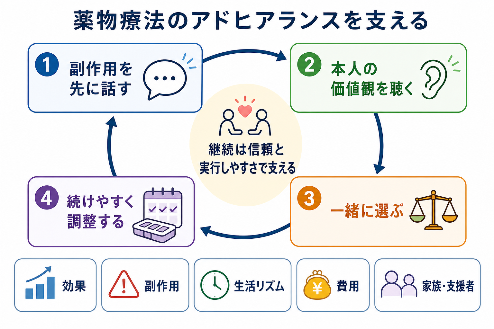
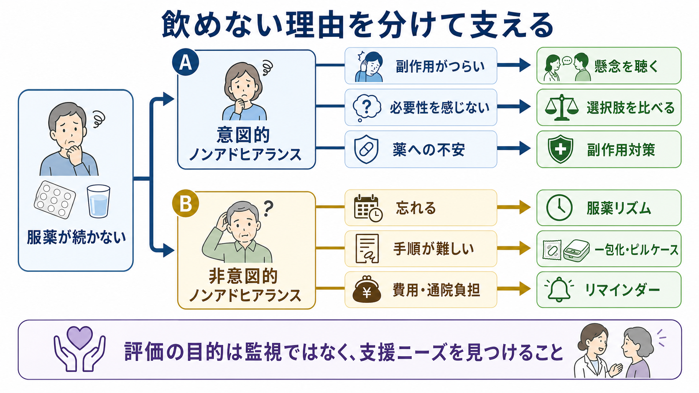

# 薬物療法のアドヒアランスをどう支えるか

## 要点

- アドヒアランスは「患者が言われた通りに飲むか」ではなく、本人と医療者が合意した治療計画を、生活の中で実行できているかを扱う概念である[1][2]。
- 服薬が続かない背景には、副作用、効果への疑問、病識、スティグマ、費用、通院負担、認知機能、生活リズム、処方の複雑さが重なる[1][5]。
- 副作用説明は不安を増やす作業ではない。予測可能な困りごとを先に共有し、早めに相談できる言葉と見直し条件を作る支援である[2][6]。
- 共同意思決定では、薬の利益と害だけでなく、本人が避けたい副作用、守りたい生活、家族・支援者の関与、治療を続ける負担を一緒に比較する[2][3]。
- 服薬支援は単独の工夫で解決するとは限らない。教育、相談、リマインダー、薬剤調整、家族・多職種支援を、その人の障壁に合わせて組み合わせる必要がある[4]。

## この記事で答える問い

1. 薬物療法のアドヒアランスを、なぜ「遵守」ではなく「合意と支援」の問題として扱うのか。
2. 副作用説明は、服薬中断を増やさずにどのように行えるのか。
3. 共同意思決定と実行しやすい服薬支援を、診療の中でどう組み合わせるのか。
4. 精神科薬物療法では、どのような点に特に注意する必要があるのか。

## まず結論

薬物療法のアドヒアランス支援で最も重要なのは、飲めない理由を「意志の弱さ」や「理解不足」に還元しないことである。WHO は、長期治療のアドヒアランスを、患者関連要因だけでなく、社会経済、医療システム、疾患、治療内容が相互作用する多次元の現象として整理している[1]。NICE も、薬を処方・調剤・レビューする場面で、非判断的にアドヒアランスを確認し、本人の懸念や薬の必要性についての考えを定期的に見直すことを勧めている[2]。

したがって実践では、次の順番が使いやすい。まず、効果だけでなく起こりうる副作用、いつ相談すべきか、どの副作用なら変更・減量・対処を検討するかを先に話す。次に、本人が何を治療の成功とみなすのか、何を避けたいのかを聞く。最後に、服薬時間、剤形、回数、費用、通院、家族や支援者の関与を調整し、定期レビューで更新する。

## 背景

長期薬物療法では、処方された薬が十分に使われなければ、研究で示された平均的な利益は現実の生活に届きにくい。NICE は、長期疾患に処方された薬のかなりの割合が推奨通りに使われていないとし、その結果として本人、医療システム、社会に損失が生じると説明している[2]。ただし、この事実は「患者を説得して飲ませる」根拠ではない。むしろ、治療計画が本人の生活条件、価値観、身体感覚、支援環境に適合しているかを見直す必要を示している。

精神科薬物療法では、この問題がさらに複雑になる。抑うつ、不安、精神病症状、躁状態、認知機能低下、物質使用、病識の揺らぎ、スティグマ、過去の治療経験が、薬への意味づけや実行可能性に影響する。主要精神疾患を対象にした系統的レビュー・メタ解析では、向精神薬のノンアドヒアランスは珍しい例外ではなく、個人要因、社会的支援、治療関連要因、疾患関連要因、医療システム要因が関連していた[5]。したがって、[[精神科薬物療法とは何か]] や [[薬物療法のリスクベネフィットをどう考えるか]] と同じく、アドヒアランス支援も薬理だけで完結しない臨床実践である。

## 基本概念

### アドヒアランス

[[アドヒアランスとは何か|アドヒアランス]]は、本人の行動が医療者の助言と一致するかを示すだけでなく、その助言が本人と合意されたものかを含む。NICE CG76 では、アドヒアランスは処方者と患者の合意を前提に、患者の行動が合意された推奨とどの程度一致するかとして扱われる[2]。この定義では、説明、選択、同意、実行環境が切り離せない。

### ノンアドヒアランス

ノンアドヒアランスには、意図的なものと非意図的なものがある。意図的ノンアドヒアランスでは、「副作用がつらい」「効果を感じない」「薬を飲む意味に納得できない」「依存や人格変化が怖い」といった判断が関わる。非意図的ノンアドヒアランスでは、飲み忘れ、複雑な服薬手順、認知機能低下、通院・費用負担、薬の管理の難しさが中心になりやすい。

この区別は責任追及のためではなく、支援を合わせるために使う。必要性への疑問が中心なら説明と共同意思決定が必要であり、飲み忘れが中心ならリマインダー、一包化、服薬タイミングの調整が役立つ可能性がある。副作用が中心なら、我慢を求めるのではなく、症状評価、用量調整、服薬時間変更、薬剤変更、身体モニタリングを検討する。

### コンコーダンスと共同意思決定

[[コンコーダンスとは何か|コンコーダンス]]は、医療者の指示に患者が従う関係ではなく、本人と医療者が治療の目標、懸念、優先順位をすり合わせる関係を指す。[[共同意思決定とは何か|共同意思決定]]はその実践形であり、NICE NG197 は、本人と医療者が一緒に治療やケアの決定に到達する協働過程として位置づけている[3]。

薬物療法では、共同意思決定は「薬を飲むか飲まないか」の二択に限られない。薬剤選択、開始用量、増量の速さ、服薬時間、副作用対策、検査頻度、心理療法や生活支援との組み合わせ、減量・中止を検討する条件まで含む。

## 仕組み

### 1. 副作用説明は先に行う

副作用を説明すると患者が薬を怖がる、という懸念は臨床ではよくある。しかし説明を避けると、実際に副作用が起きたときに「聞いていなかった」「危険な薬を出された」と感じやすく、相談前の自己中断につながる。NICE CG76 は、薬の利益とリスク、本人の誤解、希望する治療結果を話し合うことを推奨している[2]。

実践上は、すべての副作用を同じ重さで列挙するより、次の 4 層で説明すると使いやすい。

| 層 | 伝える内容 | 目的 |
|---|---|---|
| よくあるが軽いもの | 眠気、口渇、胃部不快、軽い頭痛など | 予測可能性を上げる |
| 生活に影響しやすいもの | 体重増加、性機能障害、日中の鎮静、アカシジアなど | 早期相談につなげる |
| まれだが重要なもの | 重いアレルギー、セロトニン症候群、悪性症候群、重い血液障害など | 緊急対応の目安を共有する |
| 長期モニタリングが必要なもの | 代謝副作用、血糖・脂質、プロラクチン、腎・肝・甲状腺機能など | 定期検査の意味を明確にする |

精神科では、[[抗精神病薬の錐体外路症状とは何か]]、[[抗精神病薬の代謝副作用とは何か]]、[[高プロラクチン血症とは何か]]、[[抗うつ薬の性機能障害とは何か]] などが服薬継続に直結する。たとえばアカシジアは「不安が強くなった」「落ち着かない」と誤解されると増量につながり、苦痛と中断を悪化させることがある。副作用説明は、薬を拒否させる情報ではなく、早く相談できる名前を渡す作業である。

### 2. 必要性と懸念を分けて聞く

服薬行動は、しばしば「薬が必要だと思う程度」と「薬への懸念」のバランスに影響される。NICE CG76 も、患者の薬への懸念や必要性についての考えが、服薬するかどうかに影響することを明示している[2]。したがって「ちゃんと飲めていますか」と聞くだけでは不十分である。

臨床では、次のように聞くと、非判断的に情報を得やすい。

- 「薬を飲んでいて、よかった点と困った点を分けると何がありますか。」
- 「飲み忘れと、あえて飲まなかった日は分けると、どちらが多いですか。」
- 「この副作用だけは避けたい、というものはありますか。」
- 「薬を続けるうえで、時間、費用、家族、仕事、学校のどれが一番負担ですか。」
- 「薬を減らしたい・やめたいと思うとしたら、どんな理由が大きいですか。」

ここでの目的は、服薬を監視することではない。本人が治療を続けるうえで、何が障壁になっているかを見つけることである。

### 3. 共同意思決定で選択肢を比較する

共同意思決定では、薬を勧める側が結論だけを伝えるのではなく、選択肢を比較可能な形にする。NICE NG197 は、リスク、利益、結果を本人に理解しやすい形で伝え、意思決定支援を日常診療に組み込むことを重視している[3]。

薬物療法では、比較表が有用である。

| 比較軸 | 確認する問い |
|---|---|
| 効果 | どの症状・機能・再発リスクを改善したいのか |
| 副作用 | 本人が最も避けたい副作用は何か |
| 実行可能性 | 1日何回なら続けられるか、いつ飲むのが自然か |
| モニタリング | 採血、体重測定、血圧、心電図などをどの頻度で行うか |
| 心理的意味 | 薬を飲むことが本人の自己像やスティグマにどう影響するか |
| 支援 | 家族、訪問看護、薬剤師、職場・学校調整を使えるか |

この比較は、[[インフォームドコンセントは精神科でどう行うのか]] とも接続する。精神症状や認知機能が意思決定に影響する場合でも、本人の理解可能な形に情報を調整し、可能な限り本人の価値観を反映させる必要がある。

### 4. 服薬支援は「障壁別」に選ぶ

アドヒアランス介入の研究では、単純な万能策は見つかっていない。Cochrane レビューでは、長期薬物療法のアドヒアランス改善介入は複雑で効果が一貫せず、低バイアスの試験でもアドヒアランスと臨床アウトカムの両方を改善したものは少数だった[4]。これは、支援が無意味ということではない。むしろ、障壁を見ないまま「リマインダーだけ」「説明だけ」「家族に任せるだけ」にするのは不十分だという意味である。

| 障壁 | 支援の候補 |
|---|---|
| 飲み忘れ | 服薬時刻を生活行動に結びつける、リマインダー、ピルケース、一包化 |
| 回数が多い | 可能なら用法を簡略化する、徐放剤・剤形変更を検討する |
| 副作用 | 症状評価、用量調整、服薬時間変更、対症療法、薬剤変更 |
| 効果を感じない | 効果判定時期、標的症状、評価尺度、家族・支援者情報を共有する |
| 薬への抵抗感 | 薬の意味づけ、過去の経験、スティグマ、本人の回復観を話す |
| 費用・通院負担 | ジェネリック、処方日数、通院間隔、社会資源、薬局連携を確認する |
| 認知機能低下 | 視覚的手がかり、家族・訪問看護、薬剤管理方法を調整する |

## 図解

この記事の図は、アドヒアランス支援を 2 段階で整理している。1 枚目は、服薬継続を「副作用説明」「価値観の確認」「共同意思決定」「続けやすさの調整」の循環として示す。2 枚目は、服薬が続かない理由を、意図的ノンアドヒアランスと非意図的ノンアドヒアランスに分け、それぞれに合う支援を対応させる。

## 臨床・研究との接続

### 精神科薬物療法での接続

[[抗うつ薬とは何か|抗うつ薬]]では、効果発現まで数週かかること、初期の悪心・眠気・不眠、性機能障害、賦活、中止症候群が継続に影響する。NICE の成人うつ病ガイドラインは、治療計画に沿えない要因、たとえば副作用による減薬・中止や心理療法の中断を確認し、本人と共有意思決定で対処することを勧めている[7]。

[[抗精神病薬とは何か|抗精神病薬]]では、症状軽減と再発予防の利益がある一方、錐体外路症状、アカシジア、代謝副作用、鎮静、性機能障害、高プロラクチン血症などが生活の質と服薬継続に関わる。NICE CG178 は、抗精神病薬治療中に、治療反応、副作用、運動障害、体重・代謝指標、アドヒアランス、身体健康を定期的・系統的に記録することを推奨している[6]。APA 統合失調症ガイドラインも、抗精神病薬の有効性と副作用のモニタリング、心理教育などの心理社会的介入を重視している[8]。

### 多職種連携

服薬支援は、医師だけで完結しない。薬剤師は薬剤情報、相互作用、剤形、一包化、服薬管理の相談に強い。看護師や訪問看護は、生活リズム、睡眠、食事、実際の服薬状況を観察しやすい。心理職は、薬への抵抗感、治療への意味づけ、[[心理教育とは何か|心理教育]]、[[動機づけ面接とは何か|動機づけ面接]]を扱える。家族・支援者は、本人の同意とプライバシーを尊重しながら、飲み忘れや副作用の早期サインに気づく資源になる。

### 研究上の限界

アドヒアランス研究には測定の難しさがある。自己申告、残薬確認、薬局記録、電子モニタリング、血中濃度はそれぞれ長所と限界を持つ。さらに、服薬率が上がっても、本人にとって重要なアウトカム、たとえば生活機能、再発予防、苦痛軽減、身体健康、治療満足度が改善するとは限らない。Cochrane レビューが示すように、実装可能で長期的に維持できる介入を、臨床アウトカムと合わせて検証する必要がある[4]。

## よくある誤解

### 誤解1: 飲まない人は理解していない

理解不足が関わることはあるが、それだけではない。副作用がつらい、薬への恐怖がある、費用が重い、症状が改善して必要性を感じない、飲むことで病気を意識して苦しくなるなど、本人なりの理由がある。まず理由を聞かずに教育だけを増やすと、信頼を損ねることがある。

### 誤解2: 副作用を詳しく話すと服薬しなくなる

副作用説明は、薬の危険性を強調するためではない。予測できる副作用、早く相談すべき症状、見直しの選択肢を共有することで、自己中断の前に相談できる余地を作る。説明しないことは短期的には楽でも、後から信頼を損なうリスクがある。

### 誤解3: アドヒアランス支援はリマインダーで解決する

リマインダーは、飲み忘れが主な障壁のときには役立つ。しかし、副作用、必要性への疑問、スティグマ、費用、薬剤への不信が中心なら、通知を増やしても解決しにくい。意図的か非意図的か、何が中心障壁かを分ける必要がある。

### 誤解4: アドヒアランス確認は監視である

監視として聞けば、その通りになってしまう。非判断的に聞き、本人が困っている点を見つける目的で使えば、アドヒアランス確認は支援である。「飲めなかった日があるとしたら、どんな日でしたか」と聞く方が、「ちゃんと飲んでいますか」よりも臨床的な情報を得やすい。

## 関連ノート

- [[アドヒアランスとは何か]]
- [[精神疾患と服薬アドヒアランス不良はどう関係するのか]]
- [[コンコーダンスとは何か]]
- [[共同意思決定とは何か]]
- [[意思決定支援とは何か]]
- [[インフォームドコンセントは精神科でどう行うのか]]
- [[精神科薬物療法とは何か]]
- [[薬物療法のリスクベネフィットをどう考えるか]]
- [[抗うつ薬とは何か]]
- [[抗精神病薬とは何か]]
- [[抗精神病薬の代謝副作用とは何か]]
- [[抗精神病薬の錐体外路症状とは何か]]
- [[抗うつ薬の性機能障害とは何か]]
- [[動機づけ面接とは何か]]
- [[心理教育とは何か]]

## MOC更新候補

- `content/00_MOC/MOC｜臨床実践・治療.md` の薬物療法セクションに `[[薬物療法のアドヒアランスをどう支えるか]]` を追加する。
- `content/00_MOC/MOC｜総論・診断・面接.md` のアドヒアランス、共同意思決定、コンコーダンス周辺から参照する。

並列作業との衝突を避けるため、本記事では MOC 本体は更新していない。

## 理解チェック

1. アドヒアランスを「遵守」ではなく「合意された推奨を生活内で実行できるか」と捉える理由は何か。
2. 意図的ノンアドヒアランスと非意図的ノンアドヒアランスでは、支援の焦点がどう変わるか。
3. 副作用説明を、服薬中断を増やす情報ではなく相談しやすくする情報にするには何を含めるべきか。
4. 抗精神病薬の継続支援で、効果以外に定期的に確認すべき項目は何か。
5. リマインダーが有効な場合と、有効でない場合をどう見分けるか。

## 参考文献

[1] World Health Organization. (2003). *Adherence to long-term therapies: evidence for action*. https://www.paho.org/sites/default/files/WHO-Adherence-Long-Term-Therapies-Eng-2003.pdf

[2] National Institute for Health and Care Excellence. (2009). *Medicines adherence: involving patients in decisions about prescribed medicines and supporting adherence (CG76)*. https://www.nice.org.uk/guidance/cg76

[3] National Institute for Health and Care Excellence. (2021). *Shared decision making (NG197)*. https://www.nice.org.uk/guidance/ng197

[4] Nieuwlaat, R., Wilczynski, N., Navarro, T., et al. (2014). Interventions for enhancing medication adherence. *Cochrane Database of Systematic Reviews*, 2014(11), CD000011. https://doi.org/10.1002/14651858.CD000011.pub4

[5] Semahegn, A., Torpey, K., Manu, A., et al. (2020). Psychotropic medication non-adherence and its associated factors among patients with major psychiatric disorders: a systematic review and meta-analysis. *Systematic Reviews*, 9, 17. https://doi.org/10.1186/s13643-020-1274-3

[6] National Institute for Health and Care Excellence. (2014, amended 2021). *Psychosis and schizophrenia in adults: prevention and management (CG178)*. https://www.nice.org.uk/guidance/cg178

[7] National Institute for Health and Care Excellence. (2022). *Depression in adults: treatment and management (NG222)*. https://www.nice.org.uk/guidance/ng222

[8] Keepers, G. A., Fochtmann, L. J., Anzia, J. M., et al. (2020). The American Psychiatric Association Practice Guideline for the Treatment of Patients With Schizophrenia. *American Journal of Psychiatry*, 177(9), 868-872. https://doi.org/10.1176/appi.ajp.2020.177901

## 未解決問題

- アドヒアランスを高める介入のうち、通常診療に無理なく組み込め、長期に維持できるものはどれか。
- 自己申告、薬局記録、電子モニタリング、血中濃度などを、本人の信頼を損なわずにどう使い分けるか。
- 精神症状、認知機能、スティグマ、社会的孤立が重なる人に対して、共同意思決定をどのように段階化するか。
- 減薬・中止を希望する人に対して、再発予防、離脱症状、副作用軽減、本人の価値観をどのように統合して話し合うか。
