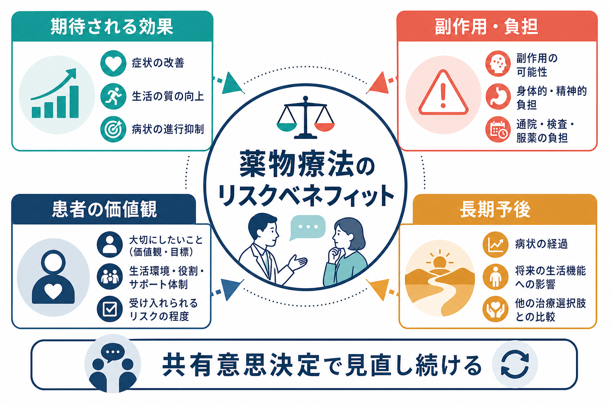
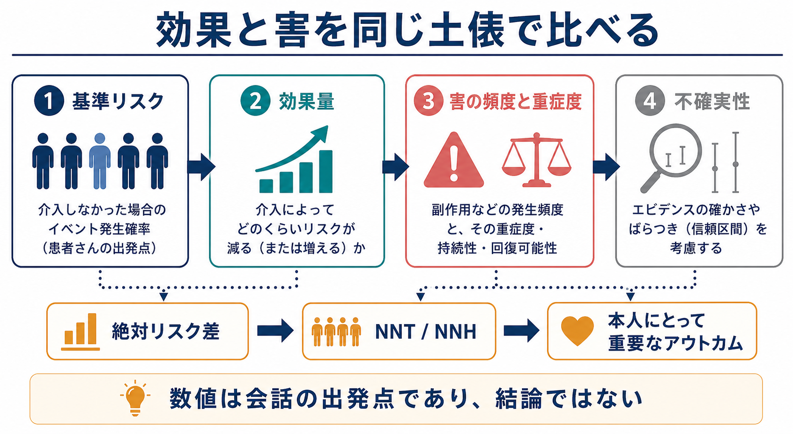
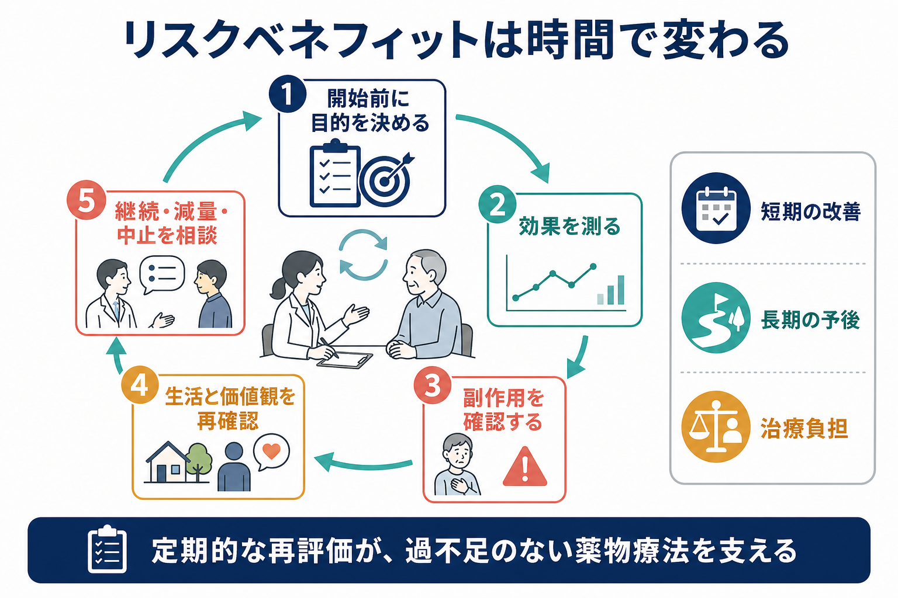

# 薬物療法のリスクベネフィットをどう考えるか

## 要点

- 薬物療法のリスクベネフィットは、「効くか、危ないか」の単純な差し引きではなく、疾患の自然経過、期待される効果、副作用、治療負担、患者本人が重視するアウトカムを同じ場に並べて考える枠組みである。
- 重要なのは相対リスクだけでなく、絶対リスク差、NNT、NNH、効果発現までの時間、副作用の可逆性、長期予後への影響である。
- 判断は一度で終わらない。開始前の仮説、開始後の測定、継続・減量・中止の再評価を繰り返す。
- 精神科・心理臨床では、症状軽減だけでなく、眠気、体重、性機能、認知機能、通院・採血負担、スティグマ、本人の回復観を明示的に扱う。
- 本稿は教育・研究目的の整理であり、個別の診断や処方変更を指示するものではない。

## この記事で答える問い

薬物療法を始める、続ける、増やす、減らす、やめるという判断では、何を「利益」と呼び、何を「リスク」と呼ぶのか。患者と臨床家は、どのような順番で情報を共有すれば、過少治療と過剰治療のどちらにも寄りすぎない意思決定に近づけるのか。

## まず結論

薬物療法のリスクベネフィットは、次の5つを順に確認すると整理しやすい。

1. 何を改善したいのかを決める。症状、再発予防、睡眠、就労、対人機能、自傷・他害リスク、身体合併症など、本人にとって意味のあるアウトカムを言語化する。
2. 薬を使わない場合の基準リスクを見積もる。重症度、既往、併存症、年齢、妊娠可能性、生活環境、支援体制でリスクは変わる。
3. 期待される効果を絶対値で捉える。相対リスク低下だけでは利益が大きく見えやすいため、絶対リスク差やNNTを併用する。
4. 害を頻度だけでなく重症度・持続性・回復可能性で評価する。軽いが頻回の副作用と、稀だが重篤な副作用は同じ尺度では扱えない。
5. 開始後に再評価する。効果が出る時期、副作用を確認する時期、継続・減量・中止を相談する条件を事前に決める。

FDAのベネフィット・リスク評価でも、利益、リスク、リスク管理、疾患背景、不確実性、患者経験データを構造化して扱うことが重視されている[1]。臨床場面ではこれを、NICEが推奨する共有意思決定、すなわちエビデンスと本人の価値観を合わせて治療を選ぶ過程として実装するのが実際的である[2]。

## 背景

薬物療法は、症状を軽減し、再発や増悪を防ぎ、生活機能を支える可能性がある。一方で、副作用、相互作用、身体モニタリング、費用、服薬負担、心理的抵抗、長期使用に伴う問題も生じうる。特に精神科では、薬の効果が本人の主観的体験、周囲の観察、生活機能、再発予防という複数の面にまたがるため、「数値上の改善」と「本人にとっての回復」がずれることがある。

もう一つの難しさは、効果と害の見積もりが直感に反しやすい点である。患者は介入の利益を過大評価し、害を過小評価する傾向があることが系統的レビューで示されている[7]。臨床家側も、利益と害の見積もりが常に正確とは限らない。そのため、経験や印象だけでなく、可能な範囲で絶対リスク、頻度、時間軸、不確実性を明示する必要がある。

## 基本概念

### ベネフィット

ベネフィットとは、薬物療法によって本人にとって望ましいアウトカムが増えることである。精神科・心身医学領域では、症状尺度の改善だけでなく、再発予防、入院回避、睡眠、仕事や学業、家族関係、生活リズム、苦痛の軽減、将来の選択肢を保つことも含まれる。

ただし、効果は「誰に、何と比べて、どの時点で、どの程度」かを分けて考える必要がある。急性期の症状改善、維持期の再発予防、長期の生活機能改善は、同じ薬でも根拠の強さや意味が異なる。

### リスク

リスクには、副作用、相互作用、禁忌、過量服薬、依存・離脱、妊娠・授乳への影響、臓器機能への影響、検査・通院負担、医療費、服薬による自己像への影響が含まれる。WHOは薬物関連有害事象を減らすために、ポリファーマシー、移行期、高リスク状況を重点領域としている[5]。

頻度だけで判断しないことが重要である。たとえば、軽度の口渇と、稀だが重篤な不整脈リスクは、同じ「副作用あり」ではない。発生頻度、重症度、本人がどれだけ困るか、可逆性、早期検出可能性、対処可能性を分けて考える。

### 基準リスクと絶対リスク差

同じ相対リスク低下でも、もとのリスクが高い人と低い人では意味が異なる。基準リスクが高い人では絶対的な利益が大きくなりやすいが、基準リスクが低い人では相対効果が大きく見えても実際の差は小さいことがある。

NNTは「何人を治療すると1人に追加の利益が生じるか」を示す指標で、臨床的な効果量を直感的に扱うために有用である[6]。一方で、NNTは対象集団、追跡期間、アウトカム定義に依存するため、数字だけを独り歩きさせない。

### 価値観

同じ副作用でも、患者によって意味は大きく異なる。眠気を避けたい人、体重増加を強く避けたい人、再発予防を最優先する人、薬を増やすより心理療法や生活調整を優先したい人がいる。共有意思決定では、リスク・ベネフィットの情報を本人の生活、信念、価値観の文脈に置いて話し合う[2]。

## 仕組み

リスクベネフィット判断は、以下のような推論として捉えられる。

| 問い | 確認する情報 | よくある落とし穴 |
|---|---|---|
| この人の基準リスクはどの程度か | 症状の重症度、再発歴、身体疾患、生活環境、支援 | 集団平均をそのまま個人に当てる |
| 薬で何がどの程度変わるか | RCT、メタ解析、診療ガイドライン、既往反応 | 相対リスクだけで利益を大きく見積もる |
| どの害が問題になるか | 頻度、重症度、可逆性、相互作用、検査負担 | 「副作用あり・なし」で二分する |
| 本人は何を重視するか | 回復目標、避けたい状態、生活上の制約 | 医療者側のアウトカムだけを優先する |
| いつ見直すか | 効果発現時期、副作用確認、終了条件 | 開始後の評価計画を作らない |

この推論は、薬を始める前だけでなく、継続中にも繰り返す。NICEの医薬品最適化ガイドラインは、薬が最大限の利益をもたらすよう、服薬レビュー、薬剤照合、患者意思決定支援を重視している[3]。薬物療法は「処方したら終わり」ではなく、薬が今も目的に合っているかを確認し続ける介入である。

## 図解

実務では、次のような短いメモを診察やカンファレンスで作ると、議論が散らばりにくい。

| 項目 | 記入例 |
|---|---|
| 目的 | 不眠の改善、再発予防、日中活動量の回復 |
| 比較対象 | 薬を使わない、心理療法を優先する、別薬にする、少量で始める |
| 期待される利益 | 何週間で、どの症状・機能が、どの程度変わる見込みか |
| 主なリスク | 眠気、体重、錐体外路症状、性機能、依存、血液・肝腎機能など |
| 本人の重みづけ | 一番避けたい副作用、受け入れられる負担、重視する回復目標 |
| 再評価条件 | 2週間後に副作用、4-8週間後に効果、必要なら減量・変更を相談 |

## 臨床・研究との接続

### 共有意思決定として扱う

患者意思決定支援ツールは、選択肢、利益・害、本人が何を重視するかを明確にするための道具である。Cochraneレビューでは、意思決定支援ツールは知識、リスク認識、価値観に沿った選択を改善しうることが示されている[4]。ただし、道具は会話の代替ではない。とくに精神科では、病識、認知機能、急性期症状、家族・支援者の関与、強制性の問題が絡むため、[[インフォームドコンセントは精神科でどう行うのか]] と合わせて考える必要がある。

### アドヒアランスは結果ではなく対話の材料

薬を飲めない、飲みたくない、途中でやめるという行動は、単なる「不遵守」ではない。副作用がつらい、効果を感じない、薬への意味づけに抵抗がある、生活リズムに合わない、費用や通院が負担であるなど、合理的な理由が隠れていることが多い。[[アドヒアランスとは何か]] は、患者の価値観と治療計画のずれを見つける入口として扱う。

### 減薬・中止もリスクベネフィットで考える

減薬や中止は「薬を使わない方が自然」という単純な話ではない。再発、離脱症状、身体リスク、患者の安心感、長期副作用、ポリファーマシーを同時に見る必要がある。deprescribingのレビューでは、全薬剤と目的の確認、薬剤性害のリスク評価、各薬剤の利益・害・負担の比較、優先順位づけ、計画的中止とモニタリングという手順が提案されている[8]。

### 薬物療法だけで閉じない

薬物療法の利益が限定的、または副作用負担が大きい場合、心理社会的介入との組み合わせを検討する。たとえば [[認知行動療法CBTとは何か]]、[[心理教育とは何か]]、[[動機づけ面接とは何か]]、[[心理療法とは何か]] は、薬物療法の代替というより、治療目標に応じて組み合わせる選択肢である。

## よくある誤解

### 「副作用がある薬は悪い」

副作用があること自体は、その薬が不適切であることを意味しない。重要なのは、期待される利益に対して、その副作用の頻度、重症度、本人にとっての困りごと、対処可能性がどう位置づくかである。

### 「エビデンスがあるなら本人の価値観は二次的でよい」

エビデンスは平均的な効果と害を教えるが、どのアウトカムを重く見るかは本人の生活と価値観に依存する。NICEの共有意思決定ガイドラインも、リスク・利益・結果を本人の生活文脈で話し合うことを推奨している[2]。

### 「飲み続けることが常に安全」

長期使用で利益が維持される薬もあれば、長期の副作用や相互作用が問題になる薬もある。継続は惰性ではなく、現時点の目的に合っているかを定期的に確認する選択である。

### 「中止すればリスクは消える」

中止にもリスクがある。再発、離脱症状、身体症状、急な生活機能低下が起こりうる。減薬・中止を行う場合は、理由、手順、速度、観察項目、再開条件を共有しておく。

## 関連ノート

- [[アドヒアランスとは何か]]
- [[インフォームドコンセントは精神科でどう行うのか]]
- [[心理教育とは何か]]
- [[認知行動療法CBTとは何か]]
- [[動機づけ面接とは何か]]
- [[心理療法とは何か]]

## 関連ノート候補

- 薬物療法とは何か
- ポリファーマシーとは何か
- 減薬・中止をどう考えるか
- 精神科薬物療法のモニタリング
- 共有意思決定とは何か

## MOC更新候補

- `content/00_MOC/MOC｜臨床実践・治療.md`
- `content/00_MOC/MOC｜精神医学.md`

並列作業との衝突を避けるため、本ジョブではMOC本文は更新していない。

## 理解チェック

1. 相対リスク低下だけで薬の利益を判断すると、どのような誤解が起こりうるか。
2. 副作用を評価するとき、頻度以外にどの要素を確認すべきか。
3. 患者の価値観は、薬物療法のどの段階で確認すべきか。
4. 薬を継続する判断と中止する判断に共通する確認項目は何か。
5. NNTやNNHを患者説明に使うとき、どのような注意が必要か。

## 参考文献

[1] U.S. Food and Drug Administration. (2023). *Benefit-Risk Assessment for New Drug and Biological Products: Guidance for Industry*. https://www.fda.gov/regulatory-information/search-fda-guidance-documents/benefit-risk-assessment-new-drug-and-biological-products

[2] National Institute for Health and Care Excellence. (2021). *Shared decision making: NICE guideline NG197*. https://www.nice.org.uk/guidance/ng197

[3] National Institute for Health and Care Excellence. (2015). *Medicines optimisation: the safe and effective use of medicines to enable the best possible outcomes: NICE guideline NG5*. https://www.nice.org.uk/guidance/ng5

[4] Stacey, D., Lewis, K. B., Smith, M., et al. (2024). Decision aids for people facing health treatment or screening decisions. *Cochrane Database of Systematic Reviews*, CD001431. https://doi.org/10.1002/14651858.CD001431.pub6

[5] World Health Organization. (2019). *Medication safety in polypharmacy: technical report*. https://www.who.int/publications/i/item/WHO-UHC-SDS-2019.11

[6] Cook, R. J., & Sackett, D. L. (1995). The number needed to treat: a clinically useful measure of treatment effect. *BMJ*, 310, 452. https://doi.org/10.1136/bmj.310.6977.452

[7] Hoffmann, T. C., & Del Mar, C. (2015). Patients' expectations of the benefits and harms of treatments, screening, and tests: a systematic review. *JAMA Internal Medicine*, 175(2), 274-286. https://doi.org/10.1001/jamainternmed.2014.6016

[8] Scott, I. A., Hilmer, S. N., Reeve, E., et al. (2015). Reducing inappropriate polypharmacy: the process of deprescribing. *JAMA Internal Medicine*, 175(5), 827-834. https://doi.org/10.1001/jamainternmed.2015.0324
