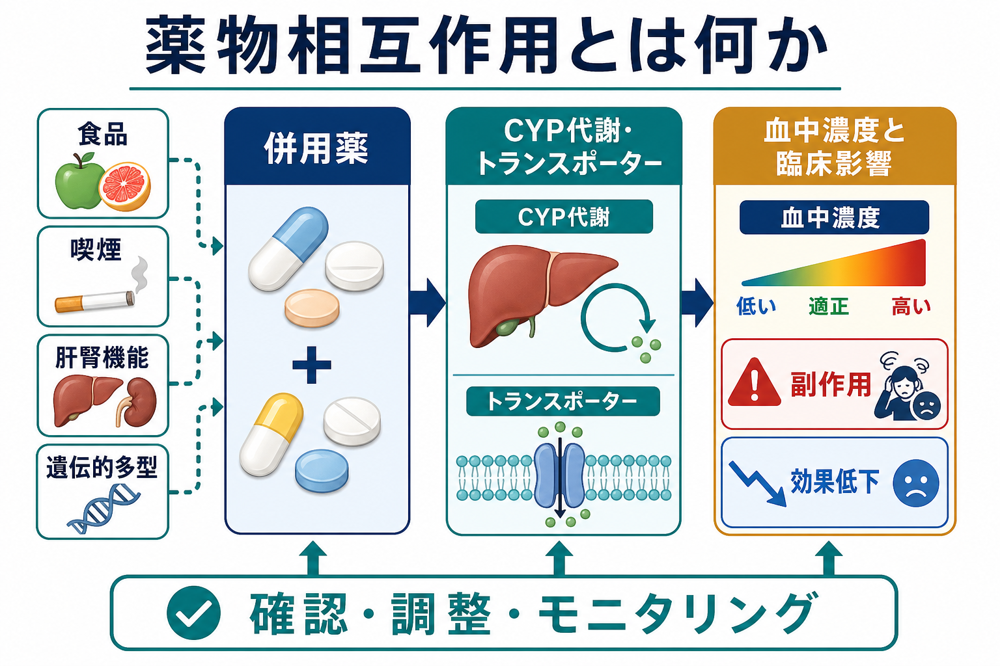
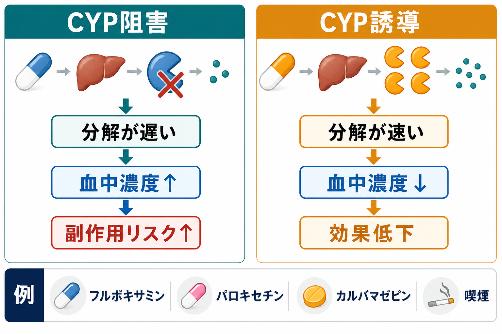

# 薬物相互作用とは何か

## 要点

- 薬物相互作用とは、併用薬、食品、喫煙、身体状態、遺伝的多型などによって、薬の血中濃度または作用が変わり、効果低下や副作用増加につながる現象である[1]。
- 精神科薬物療法では、CYP1A2、CYP2C19、CYP2D6、CYP3A などの代謝酵素が重要で、阻害は血中濃度上昇、誘導は血中濃度低下を起こしやすい[2]。
- 相互作用は「薬物動態」の問題だけではない。鎮静、QT延長、セロトニン作用、抗コリン作用、出血傾向など、作用が重なる「薬力学的相互作用」も臨床的に重要である[4][5]。
- グレープフルーツ、セイビルオレンジ、ポメロ、タンジェロ、喫煙習慣の変化など、薬以外の要因も薬物療法に影響する[6][7]。
- これは教育・研究目的の概説であり、個別の中止・増量・減量指示ではない。実際の判断では処方医・薬剤師への確認、添付文書、相互作用チェック、必要に応じた血中濃度モニタリングを組み合わせる。

## この記事で答える問い

1. 薬物相互作用は、どのような仕組みで起こるのか。
2. CYP阻害、CYP誘導、食品、喫煙、遺伝的多型は、精神科薬の効果と副作用にどう関係するのか。
3. 臨床では、相互作用をどのように見つけ、説明し、モニタリングするのか。
4. 「禁忌だけ見ればよい」「食品なら安全」といった誤解は、なぜ危ないのか。

## まず結論

薬物相互作用は、単に「薬と薬の相性が悪い」という話ではない。薬が体内に入ってから吸収、分布、代謝、排泄される流れと、薬が受容体・神経伝達・心電図・凝固系などへ及ぼす作用が、別の薬や生活要因によって変化する現象である[1]。

精神科では、[[SSRIとは何か|SSRI]]、[[SNRIとは何か|SNRI]]、[[三環系抗うつ薬とは何か|三環系抗うつ薬]]、[[抗精神病薬とは何か|抗精神病薬]]、[[気分安定薬とは何か|気分安定薬]]、[[ベンゾジアゼピン系薬とは何か|ベンゾジアゼピン系薬]]などを、身体疾患薬、抗菌薬、鎮痛薬、抗凝固薬、睡眠薬、アルコール、サプリメントと併用する場面が多い。したがって、薬物相互作用は「まれな例外」ではなく、[[精神科薬物療法とは何か|精神科薬物療法]]の安全性を左右する日常的な確認項目である。

## 背景

薬物相互作用が問題になる理由は、同じ用量でも、患者の体内で実際に到達する濃度と作用が変わるからである。FDA は、CYP酵素やトランスポーターを介した相互作用が全身曝露量を変え、高曝露では有害反応、低曝露では効果低下につながりうると説明している[1]。

精神科臨床では、相互作用の影響が症状の変動として見えることがある。たとえば、眠気、ふらつき、アカシジア、錐体外路症状、せん妄様症状、不整脈リスク、出血傾向、低ナトリウム血症、けいれん閾値低下、躁転、離脱様症状などである。これらは疾患そのものの悪化にも見えるため、薬歴と生活変化を確認しないと見逃されやすい。

特に高齢者、多剤併用、肝腎機能低下、身体合併症、妊娠可能性、過量服薬リスク、アルコール・物質使用、服薬アドヒアランスの揺れがある場合、相互作用は治療計画の中心的なリスクになる。

## 基本概念

### 薬物動態的相互作用

薬物動態的相互作用は、薬の「体内での動き」が変わる相互作用である。典型的には以下の段階で起こる。

| 段階 | 何が変わるか | 精神科での見方 |
|---|---|---|
| 吸収 | 腸管での吸収、胃内容排出、トランスポーター | 食品、制酸薬、下剤、腸管トランスポーター |
| 分布 | 蛋白結合、体脂肪、血液脳関門 | 高齢者、低アルブミン、身体疾患 |
| 代謝 | CYP酵素、UGT、肝血流 | CYP阻害・誘導、喫煙、肝機能 |
| 排泄 | 腎排泄、尿細管輸送 | 腎機能、脱水、NSAIDs、利尿薬 |

CYPを介した相互作用では、CYPを阻害する薬が併用薬の代謝を遅くし、血中濃度を上げることがある。逆に、CYPを誘導する薬は代謝を速め、血中濃度を下げることがある。FDA の表では、フルボキサミンは CYP1A2 と CYP2C19 の強い阻害薬、フルオキセチンとパロキセチンは CYP2D6 の強い阻害薬、カルバマゼピンは CYP3A などの誘導薬として扱われる[2]。

### 薬力学的相互作用

薬力学的相互作用は、血中濃度が大きく変わらなくても、薬の作用が重なって臨床効果や副作用が変わる相互作用である。たとえば、鎮静薬同士を重ねると眠気・転倒・呼吸抑制のリスクが上がる。SSRI と NSAIDs や抗凝固薬の組み合わせでは出血リスクが問題になることがある。QT延長を起こしうる薬を複数併用すれば、心電図上のリスク評価が必要になることがある[4][5]。

この区別は重要である。薬物動態的相互作用は血中濃度や代謝酵素から予測しやすい一方、薬力学的相互作用は症状観察、身体所見、検査、転倒リスク、患者の生活状況を含めて評価する必要がある。

## 仕組み

### CYP阻害

CYP阻害では、代謝酵素の働きが弱まり、基質となる薬が分解されにくくなる。その結果、同じ用量でも血中濃度が上がり、副作用が出やすくなる。たとえば、フルボキサミンは CYP1A2/CYP2C19、パロキセチンやフルオキセチンは CYP2D6 の相互作用を考える代表例である[2][4]。

精神科で注意したいのは、阻害薬そのものが精神科薬である場合である。抗うつ薬を追加したあとに、もともと使っていた抗精神病薬、三環系抗うつ薬、ベンゾジアゼピン系薬、身体疾患薬の濃度が変わり、眠気、錐体外路症状、抗コリン症状、ふらつき、QT延長などとして表面化することがある[4][5]。

### CYP誘導

CYP誘導では、代謝酵素の発現や活性が高まり、基質薬がより速く分解される。その結果、血中濃度が下がり、薬が効きにくくなることがある。FDA の表では、カルバマゼピン、フェニトイン、リファンピンなどが CYP3A などの誘導薬として挙げられる[2]。

[[カルバマゼピンとは何か|カルバマゼピン]]は精神科でも使われるため、相互作用の「被害薬」だけでなく「原因薬」にもなりうる。併用薬の効果低下、避妊薬の効果低下、抗精神病薬や抗うつ薬の血中濃度低下などを、薬効不十分や再発と誤認しないことが重要である。

### 遺伝的多型と「表現型の上書き」

CYP2D6、CYP2C19、CYP2B6 などには遺伝的多型があり、同じ薬でも代謝速度が異なる。CPIC は、CYP2D6、CYP2C19、CYP2B6 の遺伝型が一部のセロトニン再取り込み阻害薬の代謝、忍容性、投与判断に影響しうるとして、遺伝型を処方判断に使う推奨を整理している[3]。

ただし、遺伝型だけで全てが決まるわけではない。強いCYP阻害薬を併用すると、遺伝的には通常代謝型の人でも、機能的には代謝が遅い状態に近づくことがある。これはしばしば「フェノコンバージョン」と呼ばれる。臨床では、遺伝型、併用薬、喫煙、肝腎機能、年齢を合わせて考える。

### 食品・嗜好品との相互作用

食品は安全というわけではない。グレープフルーツは小腸の CYP3A4 やトランスポーターに影響し、一部の薬で血中濃度を上げたり、逆に吸収を下げたりすることがある。FDA は、影響を受ける薬かどうか、どの程度なら摂取可能か、類似の果実やジュースが問題になるかを医療者や薬剤師に確認するよう勧めている[6]。

喫煙も重要である。タバコ煙に含まれる多環芳香族炭化水素は CYP1A2 を誘導し、クロザピンやオランザピンなどの濃度を下げる方向に働くことがある。禁煙や入院による急な喫煙中断では、CYP1A2誘導が弱まり、血中濃度上昇と副作用につながりうる[7]。ニコチンそのものではなく、燃焼煙が主な問題である点も誤解されやすい。

## 図解

この記事の図は、薬物相互作用を次の2段階で読むための補助である。

1. **全体像**: 併用薬、食品、喫煙、肝腎機能、遺伝的多型が、CYP代謝・トランスポーターを介して血中濃度と臨床影響に結びつく。
2. **主要メカニズム**: CYP阻害は分解を遅くして血中濃度上昇と副作用リスクにつながりやすく、CYP誘導は分解を速くして血中濃度低下と効果低下につながりやすい。

ただし、図は簡略化である。実際には活性代謝物、複数経路の代謝、用量依存性、個人差、服薬タイミング、腎機能、薬力学的重なりが加わる。

## 臨床・研究との接続

### 薬歴確認は「処方薬リスト」だけでは足りない

相互作用を見つけるには、処方薬、頓服薬、市販薬、漢方薬、サプリメント、健康食品、アルコール、カフェイン、喫煙、違法薬物、最近の抗菌薬・抗真菌薬・鎮痛薬まで確認する。患者が「薬」と認識していないものが、相互作用の原因になることがある。

### 変化点を見る

副作用や効果低下が起きたときは、症状だけでなく時間軸を確認する。

| 変化点 | 確認すること |
|---|---|
| 新しい薬の開始 | CYP阻害薬・誘導薬、QT延長薬、鎮静薬、NSAIDs、抗凝固薬 |
| 薬の中止 | 誘導薬中止による濃度上昇、阻害薬中止による濃度低下 |
| 入院・禁煙 | クロザピン、オランザピンなど CYP1A2 基質薬の濃度変化 |
| 食習慣の変化 | グレープフルーツ、カフェイン、アルコール、サプリメント |
| 身体状態の変化 | 脱水、腎機能低下、肝機能低下、感染、発熱、低栄養 |

### TDMと検査

血中濃度モニタリングは、すべての薬で必要なわけではない。しかし、AGNP のTDMガイドラインは、効果不十分、副作用、相互作用、服薬確認、薬物代謝の遺伝的特徴、小児・高齢者などをTDMの適応として挙げている[8]。リチウム、バルプロ酸、カルバマゼピン、クロザピン、三環系抗うつ薬などでは、臨床経過と血中濃度を合わせて評価する意義が大きい。

### 研究では何を見るのか

研究では、AUC、Cmax、半減期、クリアランス、代謝物比、酵素活性、遺伝型、併用薬、喫煙状況、臨床転帰が評価される。FDA の薬物相互作用ガイダンスは、CYPやトランスポーターを介した相互作用の評価を、薬剤開発とラベリングに反映するための枠組みとして整理している[1][2]。

## よくある誤解

### 「禁忌でなければ安全」

禁忌でない併用でも、眠気、転倒、QT延長、血中濃度上昇、効果低下などが問題になることがある。禁忌は最低限の赤信号であり、黄信号のリスク評価を不要にするものではない。

### 「食品やサプリメントなら薬より安全」

食品やサプリメントにも代謝酵素やトランスポーターへ影響するものがある。グレープフルーツのように、薬の体内動態を変える食品は代表例である[6]。

### 「副作用が出たら原因薬はひとつ」

多剤併用では、ひとつの薬が単独で副作用を起こすというより、鎮静、抗コリン作用、セロトニン作用、QT延長、腎機能低下、脱水などが重なって問題になることがある。原因を一つに決めつけるより、リスクの層を分解して考える。

### 「喫煙本数が同じならリスクは一定」

入院、禁煙、電子タバコへの変更、感染症、カフェイン摂取量の変化などで、CYP1A2基質薬の濃度は変わりうる。クロザピンなど治療域が狭い薬では、喫煙状況の変化を薬歴の一部として扱う[7]。

### 「遺伝子検査をすれば相互作用は解決する」

薬理遺伝学は有用だが、併用薬、食品、喫煙、肝腎機能、年齢、炎症、服薬状況を置き換えるものではない。遺伝型はベースラインの傾向を教えるが、臨床で起きる代謝状態は環境要因によって変化する[3]。

## 関連ノート

- [[精神科薬物療法とは何か]]
- [[抗うつ薬とは何か]]
- [[SSRIとは何か]]
- [[SNRIとは何か]]
- [[三環系抗うつ薬とは何か]]
- [[抗精神病薬とは何か]]
- [[気分安定薬とは何か]]
- [[カルバマゼピンとは何か]]
- [[バルプロ酸とは何か]]
- [[ベンゾジアゼピン系薬とは何か]]
- [[薬物療法のリスクベネフィットをどう考えるか]]
- [[高齢者の薬物療法では何に注意するか]]

## MOC更新候補

- `content/00_MOC/` 配下の臨床実践・薬物療法系MOCがある場合、バッチ統合時に本記事へのリンクを追加する。
- 既存の薬物療法ノート群から、CYP、TDM、相互作用、喫煙、食品相互作用を横断する索引を作る候補になる。

## 理解チェック

1. CYP阻害とCYP誘導は、血中濃度にどのような逆方向の影響を与えるか。
2. 薬物動態的相互作用と薬力学的相互作用の違いは何か。
3. グレープフルーツや喫煙が、薬物相互作用として問題になる理由は何か。
4. 禁煙後にクロザピンの副作用が増えたとき、どのような機序を考えるか。
5. 相互作用が疑われるとき、薬歴以外にどの生活変化を確認するか。

## 参考文献

[1] U.S. Food and Drug Administration. *For Healthcare Professionals | FDA’s Examples of Drugs that Interact with CYP Enzymes and Transporter Systems*. https://www.fda.gov/drugs/drug-interactions-labeling/healthcare-professionals-fdas-examples-drugs-interact-cyp-enzymes-and-transporter-systems

[2] U.S. Food and Drug Administration. *Drug Development and Drug Interactions | Table of Substrates, Inhibitors and Inducers*. https://www.fda.gov/drugs/drug-interactions-labeling/drug-development-and-drug-interactions-table-substrates-inhibitors-and-inducers

[3] Bousman, C. A., et al. (2023). Clinical Pharmacogenetics Implementation Consortium (CPIC) Guideline for CYP2D6, CYP2C19, CYP2B6, SLC6A4, and HTR2A Genotypes and Serotonin Reuptake Inhibitor Antidepressants. *Clinical Pharmacology & Therapeutics*, 114(1), 51-68. https://doi.org/10.1002/cpt.2903

[4] Spina, E., Santoro, V., & D'Arrigo, C. (2008). Clinically relevant pharmacokinetic drug interactions with second-generation antidepressants: an update. *Clinical Therapeutics*, 30(7), 1206-1227. https://doi.org/10.1016/S0149-2918(08)80047-1

[5] Spina, E., & de Leon, J. (2014). Clinically relevant interactions between newer antidepressants and second-generation antipsychotics. *Expert Opinion on Drug Metabolism & Toxicology*, 10(5), 721-746. https://doi.org/10.1517/17425255.2014.885504

[6] U.S. Food and Drug Administration. *Grapefruit Juice and Some Drugs Don't Mix*. https://www.fda.gov/consumers/consumer-updates/grapefruit-juice-and-some-drugs-dont-mix

[7] Meyer, J. M. (2001). Individual changes in clozapine levels after smoking cessation: results and a predictive model. *Journal of Clinical Psychopharmacology*, 21(6), 569-574. https://doi.org/10.1097/00004714-200112000-00005

[8] Hiemke, C., et al. (2018). Consensus Guidelines for Therapeutic Drug Monitoring in Neuropsychopharmacology: Update 2017. *Pharmacopsychiatry*, 51(1-02), 9-62. https://doi.org/10.1055/s-0043-116492

## 未解決問題

- 日本の処方実態に即した、精神科薬と市販薬・サプリメント・食品の相互作用教育をどのように標準化するか。
- 薬理遺伝学、TDM、電子カルテの相互作用アラートを、アラート疲れを起こさず臨床判断に統合する方法。
- 喫煙、カフェイン、アルコール、入院環境変化を、薬物療法リスク評価にどの程度ルーチン化するか。
