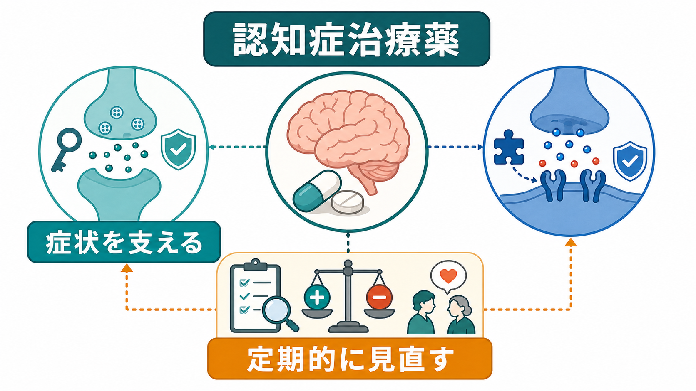
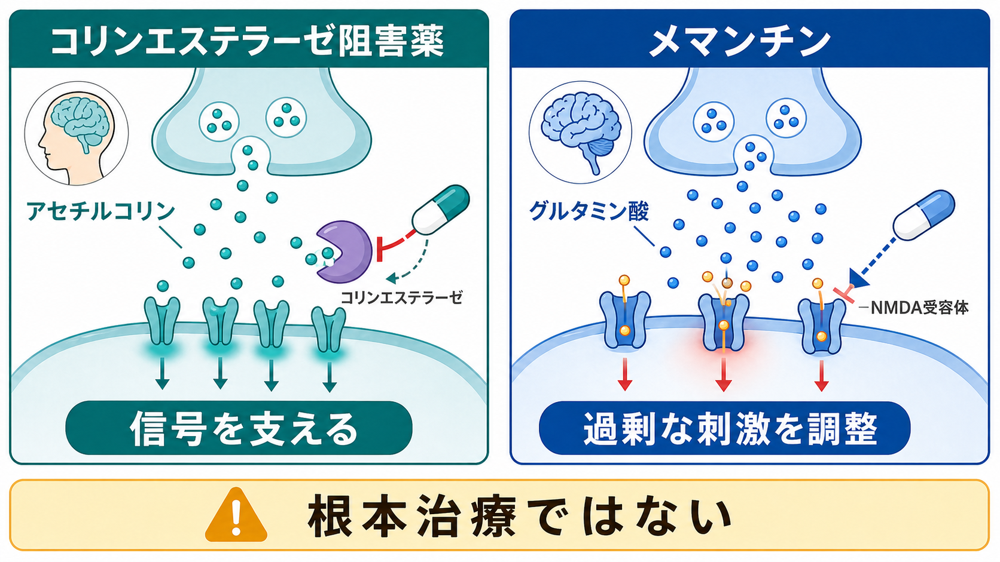
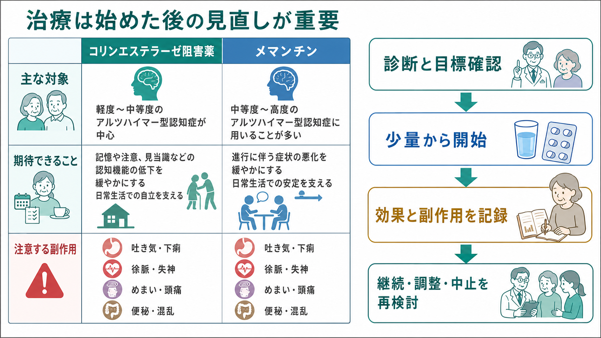

# 認知症治療薬とは何か

## 要点

- 認知症治療薬という言葉は、狭義には[[アルツハイマー型認知症とは何か|アルツハイマー型認知症]]などに用いられる**コリンエステラーゼ阻害薬**と**メマンチン**を指すことが多い。
- これらは神経変性を根本的に止める薬ではなく、認知機能、日常生活動作、行動・心理症状の一部を「少し支える」症状緩和薬として理解するのが現実的である[1][2]。
- 効果は平均すると小さく、個人差が大きい。したがって、開始前に「何を改善または維持したいのか」を本人・家族・支援者と共有し、開始後に効果と副作用を見直す必要がある[1][3][4]。
- コリンエステラーゼ阻害薬では吐き気、下痢、食欲低下、体重減少、徐脈、失神などに注意する。メマンチンではめまい、頭痛、便秘、混乱などに注意する[5][6]。
- 薬だけで[[認知症とは何か|認知症]]の生活困難を解決することはできない。薬物療法は、環境調整、介護支援、身体疾患の管理、抗コリン負荷の見直し、[[BPSDとは何か|BPSD]]への非薬物的対応と組み合わせて考える。

## この記事で答える問い

1. 認知症治療薬は何を治療しているのか。
2. コリンエステラーゼ阻害薬とメマンチンは、どのような仕組みで症状を支えるのか。
3. 効果はどの程度期待でき、どこに限界があるのか。
4. 副作用と中止・変更の判断では何を見るべきか。
5. 臨床や研究では、これらの薬をどのように位置づけるべきか。

## まず結論

認知症治療薬は、「認知症を治す薬」というより、**残っている神経伝達の働きを補い、症状の進み方や見え方を少し調整する薬**である。代表は、ドネペジル、ガランタミン、リバスチグミンなどのコリンエステラーゼ阻害薬と、NMDA受容体に作用するメマンチンである。

NICEは、ドネペジル、ガランタミン、リバスチグミンを軽度から中等度のアルツハイマー病に対する選択肢とし、メマンチンを中等度でコリンエステラーゼ阻害薬が使いにくい場合、または重度アルツハイマー病の選択肢として位置づけている[1]。WHOも、非専門医療環境での使用は訓練と監督を前提に条件付きで可能とし、コリンエステラーゼ阻害薬は主に軽度から中等度アルツハイマー病、メマンチンは中等度から重度アルツハイマー病などで検討されると整理している[2]。

ただし、平均的な効果は大きくない。Cochraneレビューでは、コリンエステラーゼ阻害薬は認知機能、全般評価、ADL、行動面に小さな利益を示す一方、消化器症状などの有害事象が増えることが示されている[3]。メマンチンについても、中等度から重度のアルツハイマー病では小さな臨床的利益があるが、軽度アルツハイマー病では利益が確認しにくい[4]。したがって、治療の核心は「処方すること」ではなく、**目標設定、開始後の観察、効果と副作用の再評価**である。

## 背景

[[アルツハイマー病では脳内で何が起きているのか|アルツハイマー病]]では、記憶や注意に関わる神経回路、特に[[アセチルコリン系は認知症とどう関わるのか|アセチルコリン系]]の機能低下が関与する。コリンエステラーゼ阻害薬は、この低下を完全に戻すのではなく、シナプス間隙に放出されたアセチルコリンが分解される速度を抑え、残っている神経伝達を使いやすくする。

一方、メマンチンはグルタミン酸系、とくにNMDA受容体に関わる。認知症では、神経変性、炎症、ネットワークの不安定化などが重なり、神経信号の「背景ノイズ」が増えるように理解されることがある。メマンチンはNMDA受容体の過剰な刺激を調整し、学習や記憶に必要な生理的な信号を妨げすぎずに、過剰な刺激を和らげることを狙う薬である[4][6]。

ここで重要なのは、薬理学的な説明を「病気の全体説明」と取り違えないことである。認知症の生活困難は、神経変性だけでなく、身体疾患、睡眠、痛み、感覚障害、服薬状況、環境、介護負担、孤立、せん妄、うつ状態などの影響を受ける。薬はその一部に働く道具であり、全体のケアを置き換えるものではない。

## 基本概念

### コリンエステラーゼ阻害薬

コリンエステラーゼ阻害薬には、ドネペジル、ガランタミン、リバスチグミンが含まれる。基本的な発想は、アセチルコリンを分解する酵素の働きを抑え、コリン作動性神経伝達を支えることである。対象として最も典型的なのは軽度から中等度のアルツハイマー型認知症であり、薬剤によって適応や剤形、忍容性が異なる。

臨床的には、記憶が大きく回復するというより、注意、会話への参加、日課の維持、家族から見た反応性などが「悪化しにくい」「少し保たれる」と表現されることが多い。レビューでは、平均的には認知機能やADL、行動面に小さな利益があるが、その効果は大きくなく、有害事象による中止も増える[3]。

### メマンチン

メマンチンはNMDA受容体拮抗薬であり、アルツハイマー型認知症では中等度から重度で検討されることが多い。NICEは、コリンエステラーゼ阻害薬に忍容性の問題や禁忌がある中等度アルツハイマー病、または重度アルツハイマー病でメマンチン単剤を選択肢としている。また、すでにコリンエステラーゼ阻害薬を使っている人では、中等度で追加を検討し、重度では追加を提示する、と整理している[1]。

Cochraneレビューでは、中等度から重度のアルツハイマー病では、全般評価、認知、ADL、行動・気分に小さな利益が示される一方、軽度アルツハイマー病での利益は支持されにくい[4]。したがって、早く使えばよいという単純な薬ではなく、病期、生活上の困りごと、併用薬、副作用、本人の目標に応じて考える薬である。

### 「治療薬」と「疾患修飾薬」の違い

従来のコリンエステラーゼ阻害薬とメマンチンは、主に症状を支える薬であり、病理そのものを確実に変える薬とは扱われない[7]。近年は抗アミロイド抗体など、病理を標的にした治療も登場しているが、対象、検査、投与体制、副作用モニタリングが大きく異なる。この記事では、日常臨床で長く使われてきた従来薬に焦点を当てる。

## 仕組み

### アセチルコリン信号を支える

アセチルコリンは、注意、記憶、覚醒、学習に関わる神経伝達物質である。アルツハイマー型認知症ではコリン作動性神経系の障害が目立つため、アセチルコリンの信号を少し長く保つことが治療標的になる。コリンエステラーゼ阻害薬は、アセチルコリンを分解する酵素を阻害し、シナプスで利用できるアセチルコリンを増やす方向に働く[3]。

この仕組みは、[[薬物療法は神経回路にどう作用するのか|薬物療法が神経回路に作用する]]典型例である。薬が「記憶を直接入れ直す」のではなく、残っている神経回路が働く条件を少し整える。したがって、生活リズム、睡眠、見当識を支える環境、会話の文脈、身体疾患の管理が整っているほど、薬の効果も観察しやすくなる。

### NMDA受容体の過剰刺激を調整する

グルタミン酸は中枢神経系で主要な興奮性神経伝達物質であり、NMDA受容体は学習やシナプス可塑性に関わる。過剰な刺激が続くと神経回路のノイズや負荷が増えるため、メマンチンはNMDA受容体の過剰な活性化を抑える方向に働く。これは、正常な信号を完全に遮断するというより、過剰な背景刺激を抑え、症状の悪化や混乱を和らげることを狙う理解である[4][6]。

ただし、「興奮毒性を抑えるから神経変性を止める」とまでは言えない。臨床試験で示されているのは、主に一定期間の症状尺度や全般評価の小さな改善または悪化抑制であり、病気の進行停止ではない[4]。

## 図解

上の図のように、臨床で重要なのは薬剤名だけでなく、**対象、期待する変化、副作用、見直しの流れ**を同時に見ることである。

| 薬剤群 | 主な考え方 | 期待される効果 | 注意する副作用・リスク |
|---|---|---|---|
| コリンエステラーゼ阻害薬 | アセチルコリン分解を抑え、残ったコリン作動性信号を支える | 認知、ADL、全般評価、行動面の小さな改善または悪化抑制[3] | 吐き気、嘔吐、下痢、食欲低下、体重減少、不眠、筋けいれん、徐脈、心ブロック、失神、消化管出血リスクなど[5] |
| メマンチン | NMDA受容体を介した過剰刺激を調整する | 中等度から重度アルツハイマー病で全般評価、認知、ADL、行動・気分の小さな利益[4] | めまい、頭痛、混乱、便秘、眠気、幻覚、腎機能や尿pHに関わる相互作用など[6] |

## 臨床・研究との接続

### 開始前に「何を見るか」を決める

認知症治療薬では、開始前の目標設定が特に重要である。「MMSEが何点上がるか」だけでなく、本人が会話に参加しやすいか、昼夜逆転が悪化していないか、食事や服薬が保たれているか、家族が観察する日常の困りごとがどう変わるかを見る。ここで目標を曖昧にすると、効果が不明なまま薬だけが続きやすい。

観察項目としては、認知機能、ADL、IADL、BPSD、睡眠、食欲、体重、脈拍、転倒、失神、便通、家族・介護者の負担を組み合わせるとよい。これは個別の処方指示ではなく、薬物療法を評価するための枠組みである。

### 副作用は「認知症の悪化」に見えることがある

副作用は、必ずしも「薬を飲んだ直後の明らかな異常」として現れるわけではない。吐き気や食欲低下は体重減少や脱水につながり、めまいは転倒につながり、徐脈や失神は活動性低下として見えることがある。混乱や眠気は「認知症が進んだ」と誤解されることもある。

このため、新しい症状が出たときは、認知症そのものの進行だけでなく、薬剤性、身体疾患、感染、脱水、疼痛、睡眠不足、[[せん妄と認知症はどう違うのか|せん妄]]を含めて見直す必要がある。NICEは、認知機能を悪化させうる抗コリン負荷のある薬を意識し、認知症の評価時や薬剤レビュー時に可能なら減らす・代替を探すことを推奨している[8]。

### 疾患別に「使う・使わない」が変わる

認知症治療薬は、認知症なら何でも同じように使う薬ではない。アルツハイマー型認知症、[[レビー小体型認知症とは何か|レビー小体型認知症]]、[[パーキンソン病認知症とは何か|パーキンソン病認知症]]、[[血管性認知症とは何か|血管性認知症]]、[[前頭側頭型認知症とは何か|前頭側頭型認知症]]では、期待される効果とリスクが異なる。

NICEは、前頭側頭型認知症にはコリンエステラーゼ阻害薬やメマンチンを提供しないよう推奨している[1]。これは、薬理学的に「認知症一般」に効くと考えるのではなく、病型、病期、症状の型に基づいて判断する必要があることを示している。

### BPSDへの薬物療法と混同しない

認知症治療薬は、[[BPSDとは何か|BPSD]]に対して万能ではない。興奮、易怒性、幻覚、妄想、睡眠障害、徘徊、介護拒否などは、痛み、便秘、感染、環境変化、孤独、不安、睡眠、感覚障害、介護者との相互作用などで変化する。薬で抑える前に、原因を探し、環境と関わり方を調整することが基本になる。

抗精神病薬や睡眠薬を併用する場合は、転倒、せん妄、過鎮静、錐体外路症状、死亡リスクなどが問題になる。したがって、認知症治療薬、向精神薬、身体疾患治療薬を別々に見るのではなく、[[薬物療法のリスクベネフィットをどう考えるか|リスクベネフィット]]全体として見直す必要がある。

## よくある誤解

### 誤解1: 認知症治療薬は認知症を治す

従来の認知症治療薬は、神経変性を根本的に止める薬ではない。期待できるのは、平均すると小さな症状緩和や悪化抑制であり、生活上の機能を少し支えることである[3][4][7]。薬の価値はゼロではないが、過大評価すると、環境調整、身体疾患管理、介護支援が後回しになる。

### 誤解2: 効果が小さいなら使う意味がない

平均効果が小さいことと、個々の人に意味がないことは同じではない。会話への反応、日課の維持、家族との交流、介護負担の軽減など、尺度に表れにくい変化が本人や家族にとって重要な場合がある。一方で、副作用や負担が上回る場合もある。だからこそ、開始前の目標と開始後の再評価が必要である。

### 誤解3: 副作用があっても認知症だから仕方ない

認知症のある人では、吐き気、めまい、徐脈、眠気、便秘、混乱、転倒などが生活機能に大きく影響する。副作用が「年齢のせい」「認知症のせい」と見落とされると、薬物療法の害が積み重なる。薬剤性の可能性を定期的に考えることは、安全な認知症ケアの一部である[5][6][8]。

### 誤解4: 薬を始めたらずっと続ける

薬を続けるかどうかは、効果、副作用、病期、本人の状態、介護環境、服薬負担、治療目標によって変わる。急な中止が混乱や症状悪化につながる場合もあるため、見直しは計画的に行う必要がある。重要なのは、「続ける」「減らす」「中止する」のどれも、観察と対話に基づく臨床判断として扱うことである。

## 関連ノート

- [[認知症とは何か]]
- [[アルツハイマー型認知症とは何か]]
- [[アルツハイマー病では脳内で何が起きているのか]]
- [[アセチルコリン系は認知症とどう関わるのか]]
- [[BPSDとは何か]]
- [[高齢者のBPSDはどう理解するのか]]
- [[せん妄と認知症はどう違うのか]]
- [[薬物療法のリスクベネフィットをどう考えるか]]
- [[精神科薬物療法とは何か]]

## 理解チェック

1. コリンエステラーゼ阻害薬は、認知症を根本的に治す薬ではなく、どの神経伝達をどのように支える薬か。
2. メマンチンが軽度アルツハイマー病よりも中等度から重度で議論されやすい理由は何か。
3. 認知症治療薬の効果を評価するとき、認知機能検査以外にどの生活上の指標を見るべきか。
4. コリンエステラーゼ阻害薬の副作用が「認知症の進行」に見えてしまう例には何があるか。
5. 抗コリン負荷の高い薬を見直すことが、認知症治療薬の効果判定にも関わるのはなぜか。

## 参考文献

[1] National Institute for Health and Care Excellence. (2018). *Dementia: assessment, management and support for people living with dementia and their carers. NICE guideline NG97.* https://www.nice.org.uk/guidance/ng97/chapter/recommendations

[2] World Health Organization. (2015, updated evidence profile). *Cholinesterase inhibitors and memantine for treatment of dementia.* https://www.who.int/teams/mental-health-and-substance-use/treatment-care/mental-health-gap-action-programme/evidence-centre/dementia/cholinesterase-inhibitors-and-memantine-for-treatment-of-dementia

[3] Birks, J. S. (2006). Cholinesterase inhibitors for Alzheimer's disease. *Cochrane Database of Systematic Reviews*, CD005593. https://doi.org/10.1002/14651858.CD005593

[4] McShane, R., Westby, M. J., Roberts, E., Minakaran, N., Schneider, L., Farrimond, L. E., Maayan, N., Ware, J., & Debarros, J. (2019). Memantine for dementia. *Cochrane Database of Systematic Reviews*, CD003154. https://doi.org/10.1002/14651858.CD003154.pub6

[5] DailyMed. (2025). *Donepezil hydrochloride tablet: prescribing information.* https://dailymed.nlm.nih.gov/dailymed/drugInfo.cfm?setid=37fc6638-4a63-4582-a64c-3525f8ed7ef2

[6] DailyMed. (2024). *Memantine hydrochloride tablet: prescribing information.* https://dailymed.nlm.nih.gov/dailymed/drugInfo.cfm?audience=consumer&setid=becb09dc-174d-4817-88d4-f38c8adcd309

[7] National Institute for Health and Care Excellence. (2018). *Dementia: Cholinesterase inhibitors and memantine for dementia.* NCBI Bookshelf. https://www.ncbi.nlm.nih.gov/books/NBK536484/

[8] National Institute for Health and Care Excellence. (2018). *Dementia: Drugs that may worsen cognitive decline.* NCBI Bookshelf. https://www.ncbi.nlm.nih.gov/books/NBK536499/

## 未解決問題

- どの患者がどの薬に反応しやすいかを、臨床的に十分な精度で予測する指標はまだ限られている。
- 長期使用で、どの時点まで利益が害を上回るかを個別に判断する方法は標準化されていない。
- 認知機能検査の変化と、本人・家族にとって意味のある生活上の変化をどう統合して評価するかは、今後も重要な課題である。

## MOC更新候補

- `content/00_MOC/` 配下に臨床実践・治療、薬物療法、認知症ケアに関するMOCがある場合、本記事を「認知症治療薬」「高齢者薬物療法」「薬物療法の見直し」の項目に追加する候補となる。
- 並列生成ジョブとの衝突を避けるため、本ジョブではMOC本文は更新していない。
