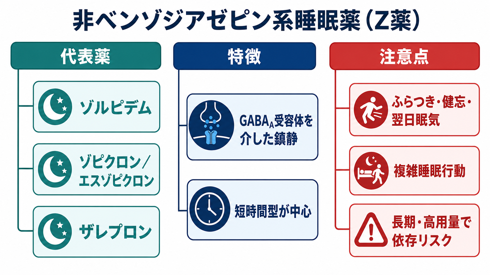
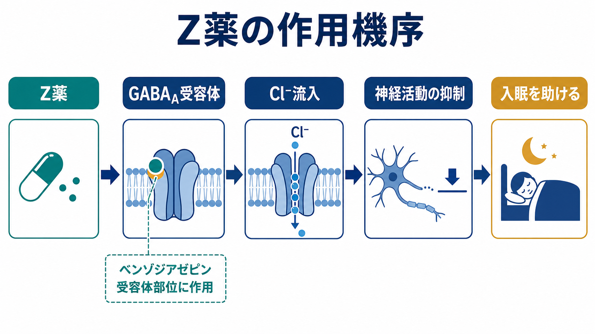
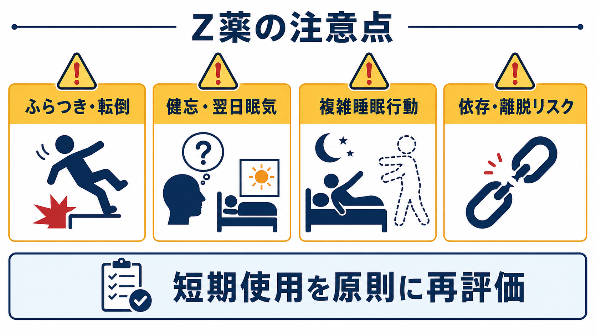

# 非ベンゾジアゼピン系睡眠薬とは何か

このノートは教育・研究目的の概説であり、個別の診断、処方、減量・中止の指示ではない。実際の使用や中止は、症状、併存疾患、年齢、併用薬、生活状況を踏まえて医療者と相談して判断する。

## 要点

- 非ベンゾジアゼピン系睡眠薬は、化学構造はベンゾジアゼピンと異なるが、主に GABA_A 受容体のベンゾジアゼピン結合部位を介して鎮静・催眠作用を示す睡眠薬群である[1]。
- ゾルピデム、ゾピクロン、エスゾピクロン、ザレプロンなどが代表で、慣用的に「Z薬」と呼ばれる。
- ベンゾジアゼピン系より「安全」と単純化されがちだが、ふらつき、転倒、健忘、翌日眠気、複雑睡眠行動、依存・離脱のリスクは残る[2][3][4]。
- 慢性不眠では、薬だけでなく睡眠習慣、生活リズム、背景疾患、[[睡眠障害は脳機能にどのような影響を与えるのか|睡眠障害]]の評価、CBT-I などの非薬物療法を含めて考える必要がある[5]。

## この記事で答える問い

- 非ベンゾジアゼピン系睡眠薬は、何が「非ベンゾ」なのか。
- Z薬はどのように眠気を強めるのか。
- ベンゾジアゼピン系睡眠薬と比べて、本当に依存しにくいのか。
- 臨床ではどのような副作用とリスクを見落としやすいのか。

## まず結論

非ベンゾジアゼピン系睡眠薬とは、「ベンゾジアゼピン骨格を持たないが、GABA_A 受容体を介して睡眠を促す睡眠薬」である。名前だけ見るとベンゾジアゼピンとは別物に見えるが、薬理学的にはベンゾジアゼピン受容体作動薬の一部として理解した方がわかりやすい。

臨床上の利点は、主に入眠困難に対する比較的速い催眠作用と、薬剤によっては半減期が短く翌日への持ち越しが少ない点にある。一方で、GABA 系の抑制を強める薬である以上、認知・運動機能の低下、転倒、健忘、脱抑制、複雑睡眠行動、依存・離脱は完全には避けられない。したがって、「短期的に眠れるようにする薬」ではあっても、「慢性不眠そのものを長期的に治す薬」とは限らない。

## 背景

不眠は、単に「眠れない」という夜間症状だけでなく、日中の眠気、集中困難、疲労、気分の不安定さ、生活機能の低下と結びつく。慢性不眠では、睡眠時間そのものよりも、眠れないことへの不安、寝床での覚醒、生活リズムの乱れ、併存する痛み・うつ・不安・睡眠時無呼吸・物質使用などが絡み合いやすい[5]。

このため、睡眠薬は不眠治療の一部であって、全体ではない。ACP の慢性不眠ガイドラインは、成人の慢性不眠に対して CBT-I を初期治療として推奨し、薬物療法を加える場合も利益・害・費用を話し合う共同意思決定を重視している[5]。AASM の薬物療法ガイドラインでは、エスゾピクロン、ザレプロン、ゾルピデムについて使用を提案しているが、推奨強度はいずれも weak であり、個別の臨床状況に応じた判断が必要とされる[2]。

日本の「睡眠薬の適正な使用と休薬のための診療ガイドライン」でも、睡眠薬は治療開始時から出口戦略を意識し、漫然とした長期処方を避け、薬効と副作用を定期的に評価することが重要とされている[6]。

## 基本概念

### 「非ベンゾジアゼピン」とは何を意味するか

「非ベンゾジアゼピン系」という言葉は、化学構造上、ベンゾジアゼピン骨格を持たないことを指す。ゾルピデムはイミダゾピリジン系、ザレプロンはピラゾロピリミジン系、ゾピクロン／エスゾピクロンはシクロピロロン系に分類される。

しかし、作用の入り口はベンゾジアゼピン系薬と近い。多くの Z薬は GABA_A 受容体のベンゾジアゼピン結合部位に作用し、GABA による塩化物イオン流入を増強して神経活動を抑制し、催眠作用を生む[1]。したがって、実務上は「非ベンゾジアゼピン系」と呼ばれても、広い意味ではベンゾジアゼピン受容体作動薬として扱われる。

### 代表薬

| 一般名 | 主な特徴 | 臨床上の注意 |
|---|---|---|
| ゾルピデム | 入眠困難に用いられる代表的 Z薬 | 複雑睡眠行動、健忘、翌日への持ち越しに注意 |
| ゾピクロン | 苦味などの味覚異常が知られる | ふらつき、眠気、相互作用に注意 |
| エスゾピクロン | ゾピクロンの S 体 | 入眠と睡眠維持の両方で検討されることがある[2] |
| ザレプロン | 超短時間作用型として扱われる | 入眠困難向きだが、再覚醒や再服用リスクの評価が必要 |

## 仕組み

Z薬の中心的な標的は、抑制性神経伝達に関わる GABA_A 受容体である。[[GABAは脳で何をしているのか|GABA]] は中枢神経系の主要な抑制性神経伝達物質で、GABA_A 受容体が活性化されると塩化物イオンが細胞内へ流入し、ニューロンが発火しにくくなる[1]。

Z薬は GABA そのものの代わりに受容体を直接開くというより、GABA が働いたときの受容体応答を強める「陽性アロステリック調節薬」として理解できる。結果として、覚醒を支える神経活動が抑えられ、入眠しやすくなる。

ベンゾジアゼピン系との違いとして、Z薬は α1 サブユニットを含む GABA_A 受容体への選択性が比較的高いと説明されることが多い。α1 サブユニットは鎮静・催眠作用と関係が深い。一方で、実際の薬理作用は単純な「α1 だけ」の話ではなく、薬剤ごとの受容体サブタイプ選択性、半減期、代謝、併用薬、年齢、基礎疾患によって変わる[1]。

この点は、[[薬物療法は神経回路にどう作用するのか|薬物療法が神経回路に作用する]]ときの一般的な注意点と同じである。薬の作用は標的分子だけで完結せず、覚醒系、記憶系、運動制御、報酬系などの回路レベルの変化として現れる。

## 図解

Z薬を一言で図解するなら、「睡眠を直接作る薬」ではなく、「GABA_A 受容体を介して覚醒側の神経活動を抑え、眠りに入りやすい状態へ傾ける薬」である。

ただし、抑制が強まる場所は睡眠系だけではない。記憶、注意、運動協調にも影響しうるため、眠気だけでなく、健忘、ふらつき、判断力低下として現れることがある。

## 臨床・研究との接続

### どのような場面で検討されるか

Z薬は、不眠症状のなかでも入眠困難を中心に検討されることが多い。AASM ガイドラインでは、ザレプロンは睡眠開始困難、ゾルピデムは睡眠開始および睡眠維持、エスゾピクロンは睡眠開始および睡眠維持への使用が提案されている[2]。ただし、これらの推奨は「薬が必要な場合に、特定の薬剤をどう選ぶか」という文脈であり、すべての不眠に薬物療法を優先するという意味ではない。

### 副作用

よく問題になる副作用は、眠気、めまい、ふらつき、注意力低下、健忘、味覚異常、頭痛などである。高齢者では転倒、骨折、せん妄、交通事故、救急受診・入院リスクが問題になりやすい。AGS Beers Criteria 2023 は、エスゾピクロン、ザレプロン、ゾルピデムを高齢者では原則回避すべき薬剤として挙げ、ベンゾジアゼピンと類似した有害事象と、睡眠改善効果の小ささを理由にしている[4]。

### 複雑睡眠行動

Z薬で特に重要なのは、服薬後に十分覚醒していない状態で歩く、運転する、食べる、電話するなどの「複雑睡眠行動」である。FDA は 2019 年に、エスゾピクロン、ザレプロン、ゾルピデムについて、重篤な傷害や死亡例を含む複雑睡眠行動のリスクを理由に boxed warning を追加した[3]。頻度としてはまれでも、起きたときの重大性が高いため、既往がある場合や疑われる場合は軽視できない。

### 依存・離脱リスク

Z薬はベンゾジアゼピンより依存しにくいと説明されることがあるが、「依存しない薬」ではない。薬理作用が GABA_A 受容体調節に関わる以上、長期使用、高用量使用、自己判断での増量、アルコールや他の中枢神経抑制薬との併用、物質使用症の既往、精神疾患の併存がある場合には、乱用、耐性、反跳性不眠、離脱症状が問題になりうる[7][8]。

依存リスクを考えるときは、「薬を飲んでいるか」だけでなく、「飲まないと眠れないという不安が強まっていないか」「効きが弱くなって用量や回数が増えていないか」「日中の眠気や健忘が見過ごされていないか」「休薬を試す計画があるか」を見る必要がある。

## よくある誤解

### 誤解1: 非ベンゾなら依存しない

非ベンゾジアゼピンという名前は、ベンゾジアゼピンではないことを示すだけで、依存リスクがゼロであることを意味しない。乱用、依存、離脱に関する薬剤監視データや症例報告は蓄積している[8]。

### 誤解2: 眠れたなら長く続けてよい

睡眠薬で眠れるようになっても、不眠を維持している認知・行動パターン、概日リズム、併存疾患がそのままなら、薬をやめたときに再燃しやすい。慢性不眠では、薬物療法の開始時点から、いつ再評価し、どの条件で減量・休薬を検討するかを考える必要がある[6]。

### 誤解3: 翌朝すっきりしていれば安全

本人が眠気を自覚していなくても、反応時間、注意、記憶、運転能力が低下していることがある。特に高齢者、睡眠時間が十分確保できない人、アルコールを併用する人、他の鎮静薬を併用する人では、翌日の行動リスクを過小評価しない。

### 誤解4: 睡眠薬は睡眠の質を自然睡眠と同じに戻す

Z薬は眠りに入りやすくするが、自然な睡眠調節を完全に再現するわけではない。睡眠の量、主観的な満足感、日中機能、薬の副作用、依存リスクを分けて評価する必要がある。

## 関連ノート

- [[GABAは脳で何をしているのか]]
- [[受容体にはどのような種類があるのか]]
- [[薬物療法は神経回路にどう作用するのか]]
- [[睡眠障害は脳機能にどのような影響を与えるのか]]
- [[精神科薬物療法とは何か]]
- [[薬物療法のリスクベネフィットをどう考えるか]]

## 理解チェック

1. 「非ベンゾジアゼピン系」という名前は、化学構造と作用機序のどちらを主に指しているか。
2. Z薬が GABA_A 受容体を介して眠気を強めるとき、塩化物イオン流入と神経発火はどう変化するか。
3. Z薬で注意すべき副作用を、夜間の行動、翌日の機能、高齢者リスク、依存・離脱の4つに分けて説明できるか。
4. 慢性不眠で、薬物療法だけでは不十分になりやすい理由は何か。

## 関連ノート候補

- ベンゾジアゼピン系睡眠薬とは何か
- 睡眠薬の減量・休薬をどう考えるか
- CBT-Iとは何か
- 睡眠薬と転倒リスク
- 複雑睡眠行動とは何か

## MOC更新候補

- `content/00_MOC/` 配下の臨床実践・治療、精神科薬物療法、睡眠医学関連 MOC に追加候補。
- 並列ジョブとの競合を避けるため、このタスクでは MOC 本体は更新しない。

## 未解決問題

- Z薬の薬剤間差は、受容体サブタイプ選択性、薬物動態、臨床アウトカムのどれで説明するのが最も妥当か。
- 長期使用者の減量・休薬を、反跳性不眠を最小化しながらどう支援するか。
- 高齢者や多剤併用患者で、Z薬以外の選択肢と非薬物療法をどう組み合わせるか。

## 参考文献

[1] Richter G, Liao VWY, Ahring PK, Chebib M. (2020). The Z-Drugs Zolpidem, Zaleplon, and Eszopiclone Have Varying Actions on Human GABA_A Receptors Containing γ1, γ2, and γ3 Subunits. *Frontiers in Neuroscience*, 14, 599812. https://doi.org/10.3389/fnins.2020.599812

[2] Sateia MJ, Buysse DJ, Krystal AD, Neubauer DN, Heald JL. (2017). Clinical Practice Guideline for the Pharmacologic Treatment of Chronic Insomnia in Adults: An American Academy of Sleep Medicine Clinical Practice Guideline. *Journal of Clinical Sleep Medicine*, 13(2), 307-349. https://doi.org/10.5664/jcsm.6470

[3] U.S. Food and Drug Administration. (2019). Certain Prescription Insomnia Medicines: New Boxed Warning - Due to Risk of Serious Injuries Caused by Sleepwalking, Sleep Driving and Engaging in Other Activities While Not Fully Awake. https://www.fda.gov/safety/medical-product-safety-information/certain-prescription-insomnia-medicines-new-boxed-warning-due-risk-serious-injuries-caused

[4] American Geriatrics Society Beers Criteria Update Expert Panel. (2023). American Geriatrics Society 2023 updated AGS Beers Criteria for potentially inappropriate medication use in older adults. *Journal of the American Geriatrics Society*, 71(7), 2052-2081. https://doi.org/10.1111/jgs.18372

[5] Qaseem A, Kansagara D, Forciea MA, Cooke M, Denberg TD. (2016). Management of Chronic Insomnia Disorder in Adults: A Clinical Practice Guideline From the American College of Physicians. *Annals of Internal Medicine*, 165(2), 125-133. https://doi.org/10.7326/M15-2175

[6] 厚生労働科学研究班・日本睡眠学会ワーキンググループ. (2013). 睡眠薬の適正な使用と休薬のための診療ガイドライン. https://jssr.jp/files/guideline/suiminyaku-guideline.pdf

[7] Gunja N. (2013). The Clinical and Forensic Toxicology of Z-drugs. *Journal of Medical Toxicology*, 9(2), 155-162. https://doi.org/10.1007/s13181-013-0292-0

[8] Schifano F, Chiappini S, Corkery JM, Guirguis A. (2019). An Insight into Z-Drug Abuse and Dependence: An Examination of Reports to the European Medicines Agency Database of Suspected Adverse Drug Reactions. *International Journal of Neuropsychopharmacology*, 22(4), 270-277. https://doi.org/10.1093/ijnp/pyz007
