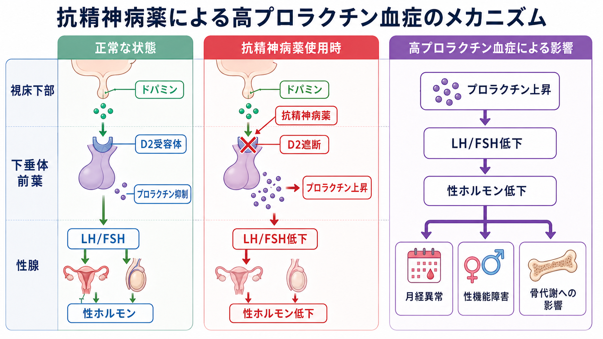
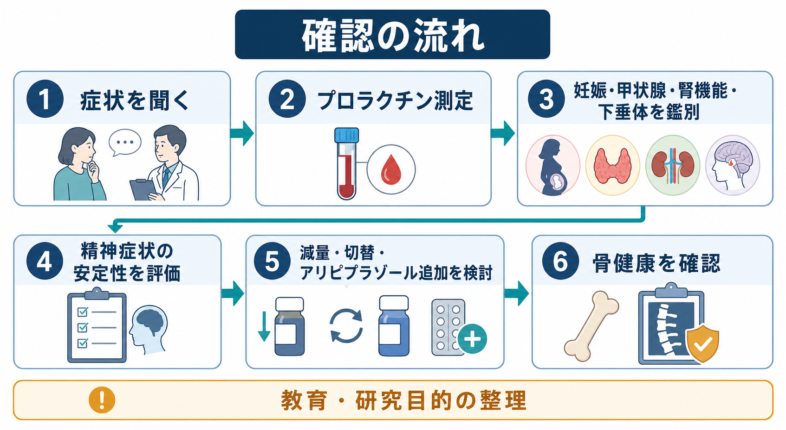

# 高プロラクチン血症とは何か

## 要点

- 高プロラクチン血症とは、血中プロラクチンが基準範囲を超えて高い状態である。精神科では、抗精神病薬によるドパミンD2受容体遮断が重要な原因になる。
- 症状は、月経異常、無月経、乳汁分泌、乳房緊満、性欲低下、勃起・射精障害、不妊、骨密度低下などに及ぶ。症状が恥ずかしさや言いにくさを伴うため、医療者側から確認しないと見逃されやすい。
- リスクは薬剤ごとに異なる。リスペリドン、パリペリドン、アミスルプリド、一部の定型抗精神病薬は上げやすく、アリピプラゾール、クエチアピン、クロザピンなどは比較的上げにくい薬剤として扱われることが多い[3][4]。
- 対応は「プロラクチン値を下げる」だけではなく、精神症状の安定、再発リスク、本人が困っている症状、骨健康、妊娠可能性、ほかの内分泌疾患を同時に見る必要がある[1][2][5]。

## この記事で答える問い

1. 抗精神病薬はなぜプロラクチンを上げるのか。
2. 月経異常、乳汁分泌、性機能障害、骨代謝はどのようにつながるのか。
3. 臨床では何を確認し、どのような選択肢を考えるのか。

## まず結論

抗精神病薬による高プロラクチン血症は、下垂体前葉の乳腺刺激ホルモン産生細胞に対するドパミンの抑制が、D2受容体遮断によって弱まることで起こる。プロラクチンが高い状態が続くと、視床下部-下垂体-性腺軸が抑制され、LH/FSH低下、エストロゲンまたはテストステロン低下を介して、月経異常、性機能障害、不妊、骨密度低下へ波及しうる[1][3][5]。

ただし、プロラクチン値だけで治療方針は決まらない。無症状なら経過観察が妥当な場合もある一方、症状が強い、長期の性腺機能低下がある、骨量低下が疑われる、値が薬剤性として典型的でない、発症時期が薬剤変更と合わない場合には、妊娠、甲状腺機能低下、腎機能障害、下垂体病変、ほかの薬剤などを確認する[1][5]。本記事は教育・研究目的の整理であり、個別の中止・減量・切替を指示するものではない。

## 背景

抗精神病薬は、[[精神科薬物療法とは何か]]の中で、精神病症状、興奮、再発予防などに重要な役割を持つ。一方で、薬剤選択では効果だけでなく、代謝、錐体外路症状、心血管系、内分泌、主観的な不快感を含む副作用を比較する必要がある。NICEの成人精神病・統合失調症ガイドラインも、抗精神病薬開始前にプロラクチン値を含むベースライン評価を行い、薬剤の利益と副作用を本人と共有することを推奨している[2]。

高プロラクチン血症は、[[抗精神病薬の錐体外路症状とは何か]]のように動きとして目立つ副作用ではない。月経、乳汁分泌、性機能、不妊、骨密度という私的で長期的な領域に現れやすい。そのため、[[薬物療法のリスクベネフィットをどう考えるか]]で扱うように、「症状が軽いから問題ない」と判断するのではなく、本人が話しやすい形で具体的に確認する必要がある。

## 基本概念

プロラクチンは下垂体前葉から分泌されるホルモンで、乳汁分泌だけでなく、生殖機能や性腺機能とも関係する。特徴的なのは、通常の多くの下垂体ホルモンと異なり、ドパミンによって常に抑制されている点である。つまり、ドパミン作用が弱まるとプロラクチンは上がりやすい[1][4]。

抗精神病薬は主にD2受容体遮断を通じて抗精神病作用を示すが、この遮断は中脳辺縁系だけでなく、下垂体近傍の結節漏斗路にも影響する。下垂体は血液脳関門の影響を比較的受けにくいため、薬剤によっては下垂体D2受容体への作用が強く出る。リスペリドンやパリペリドンでプロラクチン上昇が問題になりやすい背景には、この薬理学的特徴が関係する[3][4]。

高プロラクチン血症は、症状の有無で臨床的意味が変わる。軽度高値で無症状の場合と、無月経、乳汁分泌、性機能障害、骨量低下を伴う場合では、確認すべきことも対応の緊急度も異なる。内分泌学会ガイドラインは、症候性の非生理的高プロラクチン血症では、薬剤、腎不全、甲状腺機能低下、下垂体・傍鞍部腫瘍などを除外することを推奨している[1]。

## 仕組み

通常、視床下部からのドパミンは下垂体前葉のD2受容体に作用し、プロラクチン分泌を抑えている。抗精神病薬がD2受容体を遮断すると、このブレーキが外れ、プロラクチンが上昇する。プロラクチン上昇はGnRH、LH、FSHの調節に影響し、性ホルモン低下を介して臨床症状へつながる[1][3]。

### 月経異常・乳汁分泌

女性では、月経不順、希発月経、無月経、排卵障害、不妊、乳汁分泌が問題になる。乳汁分泌はプロラクチンの乳腺への直接作用として理解しやすい。一方、月経異常は、プロラクチンが性腺軸を抑えることで起こる。症状が「薬の副作用」と結びつけられず、婦人科的問題やストレスだけとして扱われることもあるため、服薬歴との時間関係を確認する必要がある[1][3][5]。

### 性機能障害

性機能障害は、性欲低下、勃起障害、射精障害、オルガズム障害、性交痛、満足度低下などとして現れる。抗精神病薬による鎮静、陰性症状、抑うつ、不安、対人関係、身体疾患、ほかの薬剤も影響するため、すべてをプロラクチンだけで説明してはいけない。とはいえ、高プロラクチン血症は性腺機能低下を通じて性機能に影響しうるため、[[抗うつ薬の性機能障害とは何か]]と同様に、本人が話しやすい聞き方を設計することが重要である[3][4]。

### 骨代謝

長期の高プロラクチン血症では、性ホルモン低下を介して骨密度低下、骨粗鬆症、骨折リスクが問題になりうる。統合失調症のある人では、喫煙、飲酒、活動量低下、栄養、ビタミンD不足、転倒リスクなども骨健康に関わるため、骨代謝を薬剤だけに還元しないことが大切である[5][7]。[[身体合併症は精神科診療でなぜ重要なのか]]の視点からは、内分泌副作用も長期予後の一部として扱う必要がある。

## 図解

図1は、抗精神病薬がD2受容体を遮断し、プロラクチン上昇から性腺機能低下、月経異常・性機能障害・骨代謝への影響へつながる流れを整理している。図2は、症状確認、採血、鑑別、精神症状の安定性評価、薬剤調整、骨健康確認という臨床的な確認手順を示している。

画像生成では3枚目の候補も作成したが、対象外薬剤の内容が混入したため本文には挿入していない。必要なら、次の図解案として「薬剤別にプロラクチン上昇リスクを比較し、リスペリドン・パリペリドン・アミスルプリド・定型抗精神病薬を高リスク、アリピプラゾール・クエチアピン・クロザピンを相対的低リスクとして整理する日本語インフォグラフィック」を追加候補にできる。

## 臨床・研究との接続

臨床では、まず症状を具体的に確認する。月経周期、無月経の期間、乳汁分泌、乳房症状、性欲、勃起・射精、妊娠可能性、不妊の困り、骨折歴、転倒、食事、活動量を聞く。次に、プロラクチン値を測定し、採血時のストレス、時間帯、妊娠、授乳、甲状腺、腎機能、下垂体病変、メトクロプラミドなどほかの薬剤を鑑別する[1][5]。

対応の選択肢には、原因薬剤の減量、プロラクチンを上げにくい薬剤への切替、アリピプラゾールの追加、ドパミン作動薬、性ホルモン補充、骨健康への介入などがある。ただし、精神症状が安定している薬剤を変更すると再燃リスクが生じる。内分泌学会ガイドラインも、抗精神病薬の中止や変更は担当医と相談せずに行うべきではないと明示している[1]。アリピプラゾール追加については、ランダム化比較試験のメタ解析でプロラクチン正常化への有効性が示されているが、用量、アカシジア、賦活、精神症状への影響、併用薬との関係を個別に見る必要がある[6]。

研究面では、薬剤ごとのD2占有率、D2受容体からの解離速度、血液脳関門通過性、部分作動薬としての性質、患者側の性別・年齢・遺伝的要因がプロラクチン上昇リスクに関わる。したがって、「非定型抗精神病薬なら安全」とは言えない。実際には、薬剤クラスよりも「プロラクチンを上げやすいか、上げにくいか」という軸で整理した方が臨床的である[3][4]。

## よくある誤解

### 「プロラクチン値が高ければ、必ず薬を中止する」

そうではない。無症状か症候性か、値の程度、発症時期、本人の困り、精神症状の再燃リスク、代替薬の副作用を合わせて考える。中止や変更は自己判断で行わず、医療者と相談して進める必要がある[1][5]。

### 「月経異常や性機能障害は、本人が困っていれば必ず言う」

言いにくさ、恥ずかしさ、医療者に関係ないと思っていること、精神症状や生活問題の陰に隠れることがある。副作用評価では、眠気や体重だけでなく、月経、乳汁、性機能、妊娠希望、骨健康を具体的に聞く必要がある。

### 「非定型抗精神病薬なら高プロラクチン血症は起こらない」

誤りである。リスペリドンやパリペリドンのように、非定型抗精神病薬でもプロラクチンを上げやすい薬剤がある。逆に、アリピプラゾールのようにプロラクチンを下げる方向に働くことがある薬剤もある[3][4]。

### 「骨代謝への影響は女性だけの問題である」

男性でも、性腺機能低下、性機能障害、不妊、骨密度低下は問題になりうる。女性の月経異常が目立ちやすいだけで、男性の症状も積極的に確認する必要がある[3][7]。

## 関連ノート

- [[精神科薬物療法とは何か]]
- [[薬物療法のリスクベネフィットをどう考えるか]]
- [[抗精神病薬の錐体外路症状とは何か]]
- [[抗うつ薬の性機能障害とは何か]]
- [[身体合併症は精神科診療でなぜ重要なのか]]
- [[薬剤性精神症状とは何か]]
- [[統合失調症とは何か]]
- [[統合失調症の陰性症状とは何か]]

## 理解チェック

1. 抗精神病薬による高プロラクチン血症は、どのドパミン経路と下垂体機能に関係するか。
2. 月経異常、性機能障害、骨密度低下は、プロラクチン上昇からどのような内分泌経路でつながるか。
3. プロラクチン高値が見つかったとき、薬剤以外に確認すべき鑑別は何か。
4. 減量、切替、アリピプラゾール追加を考えるとき、精神症状の安定性をなぜ同時に評価する必要があるか。

## 参考文献

[1] Melmed S, Casanueva FF, Hoffman AR, Kleinberg DL, Montori VM, Schlechte JA, Wass JAH. Diagnosis and Treatment of Hyperprolactinemia: An Endocrine Society Clinical Practice Guideline. *The Journal of Clinical Endocrinology & Metabolism*. 2011;96(2):273-288. https://doi.org/10.1210/jc.2010-1692

[2] National Institute for Health and Care Excellence. Psychosis and schizophrenia in adults: prevention and management. NICE Clinical Guideline CG178. 2014, amended 2021. https://www.nice.org.uk/guidance/cg178/chapter/Recommendations

[3] Haddad PM, Wieck A. Antipsychotic-induced hyperprolactinaemia: mechanisms, clinical features and management. *Drugs*. 2004;64(20):2291-2314. https://doi.org/10.2165/00003495-200464200-00003

[4] Peuskens J, Pani L, Detraux J, De Hert M. The Effects of Novel and Newly Approved Antipsychotics on Serum Prolactin Levels: A Comprehensive Review. *CNS Drugs*. 2014;28(5):421-453. https://doi.org/10.1007/s40263-014-0157-3

[5] Tewksbury A, Olander A. Management of antipsychotic-induced hyperprolactinemia. *Mental Health Clinician*. 2016;6(4):185-190. https://doi.org/10.9740/mhc.2016.07.185

[6] Li X, Tang Y, Wang C. Adjunctive Aripiprazole Versus Placebo for Antipsychotic-Induced Hyperprolactinemia: Meta-Analysis of Randomized Controlled Trials. *PLOS ONE*. 2013;8(8):e70179. https://doi.org/10.1371/journal.pone.0070179

[7] Stubbs B. Antipsychotic-induced hyperprolactinaemia in patients with schizophrenia: considerations in relation to bone mineral density. *Journal of Psychiatric and Mental Health Nursing*. 2009;16(9):838-842. https://doi.org/10.1111/j.1365-2850.2009.01472.x

## 未解決問題

- 無症候性の軽度高プロラクチン血症をどの頻度で追跡すべきかは、ガイドライン間でも実務差がある。
- アリピプラゾール追加、切替、減量のどれが最適かは、精神症状の安定性、過去の再燃歴、併用薬、本人の優先順位によって変わる。
- 長期の骨健康に対して、プロラクチン、性ホルモン、生活習慣、疾患特性、薬剤全体の寄与をどう分けて評価するかは研究途上である。

## MOC更新候補

- `content/00_MOC/MOC｜臨床実践・治療.md`
- `content/00_MOC/MOC｜精神医学.md`
- `content/00_MOC/MOC｜総論・診断・面接.md`
