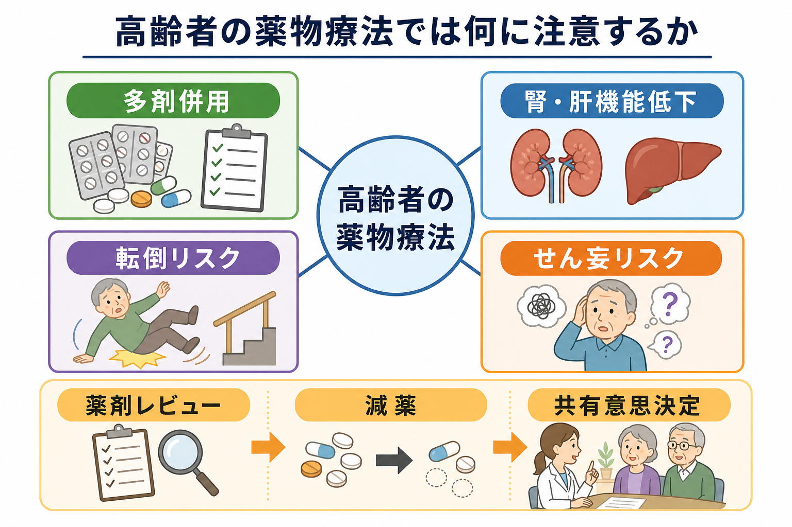
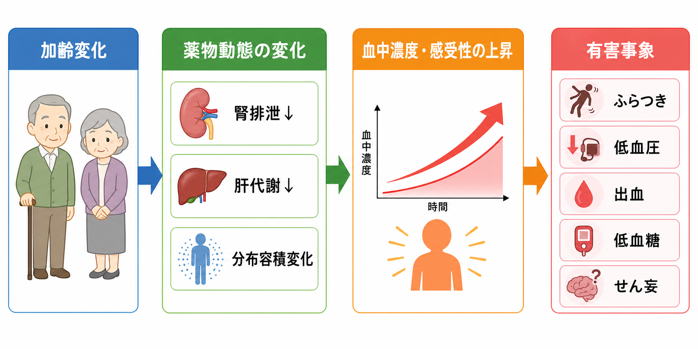
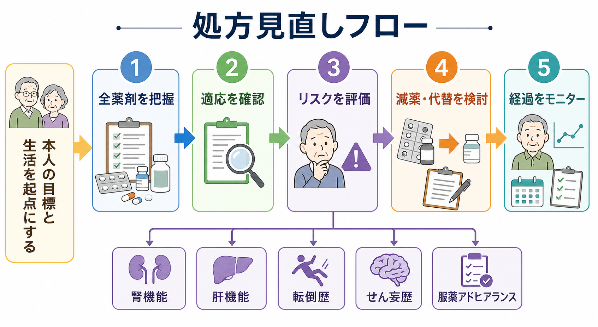

# 高齢者の薬物療法では何に注意するか

## 要点

- 高齢者の薬物療法では、「薬の数」だけでなく、適応、治療目標、腎・肝機能、認知機能、転倒歴、生活機能を同時に見る。
- 多剤併用は、相互作用、処方カスケード、服薬ミス、有害事象の発見遅れを増やす。定期的な薬剤レビューが中心介入になる[1][4]。
- 腎排泄薬、鎮静・抗コリン作用をもつ薬、降圧薬、抗凝固薬、血糖降下薬、向精神薬は、転倒・せん妄・出血・低血糖を意識して見直す[2][5][6][7]。
- 減薬は「不要な薬を止める作業」だけではない。本人の目標、予後、生活上の負担、再燃リスクを共有し、少量ずつ変更してモニターする臨床プロセスである[4][8]。

## この記事で答える問い

- 高齢者で薬物有害事象が増えやすいのはなぜか。
- 多剤併用を見つけたとき、何から確認すべきか。
- 腎・肝機能低下、転倒、せん妄を処方見直しにどう組み込むか。
- 減薬を行うとき、何を避けるべきか。

## まず結論

高齢者の薬物療法では、疾患ごとの標準治療を単純に足し合わせると、本人にとって過剰な治療負担になりうる。したがって処方は、各薬剤の「疾患上の正しさ」だけでなく、本人の生活目標、余命・フレイル、腎機能、認知機能、転倒リスク、介護環境、服薬管理能力に照らして再評価する必要がある[1][4]。

実務上は、まず全薬剤を把握し、各薬剤に現在の適応があるかを確認する。そのうえで、Potentially Inappropriate Medications（PIMs; 潜在的に不適切な薬剤）と Potential Prescribing Omissions（PPOs; 必要薬の過少処方）の両方を点検する。Beers Criteria や STOPP/START Criteria は、この点検を構造化する補助ツールであり、個別判断を置き換えるものではない[2][3]。

## 背景

高齢者では、慢性疾患が複数併存しやすく、処方医療機関も複数になりやすい。その結果、同じ症状に対する重複処方、相互作用、漫然投与、処方カスケードが起こりやすい。厚生労働省の「高齢者の医薬品適正使用の指針」も、薬物有害事象を防ぐために、処方内容を一元的に把握し、多職種で見直すことを重視している[1]。

一方で、「高齢者だから薬を減らせばよい」という単純な話ではない。STOPP/START Criteria が示すように、不適切な薬剤を減らすことと、必要な薬剤の抜けを見つけることは同時に扱うべきである[3]。例えば、転倒リスクの高い鎮静薬を見直すことは重要だが、骨粗鬆症治療や疼痛管理が不十分であれば、別の形で機能低下を招く可能性がある。

## 基本概念

### 多剤併用

多剤併用は一般に複数の薬剤を同時に使用している状態を指すが、問題は数そのものではなく「その組み合わせが本人にとって適切か」である。5剤以上だから必ず悪いわけではなく、必要な薬剤が十分に整理され、効果と副作用が追跡されているなら合理的な場合もある。問題になるのは、適応が不明、効果判定がない、相互作用が大きい、服薬負担が本人の管理能力を超える、といった「不適切な多剤併用」である[4]。

### PIMs と PPOs

PIMs は、利益より害が上回りやすい、またはより安全な代替がある薬剤・薬剤クラスを指す。AGS Beers Criteria は、65歳以上の成人で避けるべき薬、疾患・症候群ごとに避けるべき薬、腎機能に応じた用量調整、注意すべき相互作用を整理している[2]。

PPOs は、適応があるのに処方されていない、または過少に扱われている治療を指す。STOPP/START Criteria version 3 は、PIMs だけでなく PPOs も扱い、減薬と必要薬の補正をセットで考える枠組みを提供する[3]。

### 処方カスケード

処方カスケードとは、薬剤の副作用を新しい疾患や症状と誤認し、その副作用に対してさらに薬を追加する流れである。例えば、薬剤性のふらつきに対して別の薬が追加されると、原因が見えにくくなる。新しい症状が出たときは、まず「最近始まった薬、増量された薬、相互作用」を確認する。

## 仕組み

### 薬物動態と薬力学の変化

加齢に伴って腎血流量や糸球体濾過量は低下しやすく、腎排泄薬では血中濃度が上がりやすい。筋肉量が少ない高齢者では血清クレアチニンが一見正常でも腎機能が低いことがあり、腎排泄薬や治療域の狭い薬では eGFR、推算クレアチニンクリアランス、必要に応じたシスタチンCなどを合わせて考える[5]。

肝代謝も、肝血流低下、低アルブミン血症、併用薬による酵素阻害・誘導の影響を受ける。さらに、同じ血中濃度でも中枢神経系への感受性が高まり、鎮静、ふらつき、認知機能低下、せん妄が出やすくなる。[[ベンゾジアゼピン系薬とは何か]]、一部の抗コリン薬、三環系抗うつ薬、睡眠薬、オピオイド、抗精神病薬は、効果だけでなく転倒・せん妄リスクを必ず評価する[2][6][7]。

### 転倒リスク

転倒は、筋力低下や視力障害だけでなく、薬剤によっても増える。特に、鎮静、起立性低血圧、低血糖、ふらつき、反応時間低下を起こす薬剤は、単剤でもリスクになり、複数併用でさらに増幅する。CDC STEADI は、転倒予防の一部として薬剤レビューを位置づけ、薬剤師を含む連携を重視している[6]。

処方見直しでは、転倒歴、立ちくらみ、夜間トイレ、眠気、アルコール使用、歩行補助具、血圧・血糖の実測値を合わせて確認する。降圧薬を減らすか、睡眠薬を減らすか、疼痛管理を改善するかは、単独の薬剤名ではなく、本人の転倒パターンから考える。

### せん妄リスク

せん妄は、急性発症の注意・意識・認知の変動を特徴とする状態で、入院、感染、脱水、疼痛、睡眠障害、環境変化、薬剤が重なって起こりやすい。NICE は、病院や長期ケア施設で、65歳以上、認知機能障害、股関節骨折、重症疾患などをリスク因子として評価することを推奨している[7]。

薬剤面では、抗コリン作用、鎮静作用、ベンゾジアゼピン系薬、オピオイド、急な中止による離脱、腎機能低下による蓄積を確認する。[[抗精神病薬とは何か]]は、せん妄そのものを治す万能薬ではなく、強い苦痛や危険があり非薬物的対応だけでは不十分な場合に、短期間・少量・再評価を前提に検討される。

## 図解

高齢者の薬物療法は、次の5段階で見直すと実務に落とし込みやすい。

1. 処方薬、市販薬、サプリメント、頓用薬を含めて全薬剤を把握する。
2. 各薬剤の現在の適応、開始理由、効果判定、終了条件を確認する。
3. 腎機能、肝機能、転倒歴、せん妄歴、服薬アドヒアランスを評価する。
4. 中止、減量、代替、投与タイミング変更、必要薬の追加を検討する。
5. 症状再燃、離脱症状、血圧・血糖・凝固能、生活機能をモニターする。

## 臨床・研究との接続

[[精神科薬物療法とは何か]]では、症状軽減と副作用のバランスが常に問題になる。高齢者ではこのバランスがさらに狭くなり、同じ用量でも眠気、ふらつき、認知機能低下、錐体外路症状、低ナトリウム血症などが臨床的に大きな意味をもつ。[[抗うつ薬とは何か]]、[[SSRIとは何か]]、[[三環系抗うつ薬とは何か]]、[[抗精神病薬とは何か]]を選ぶときも、疾患別の有効性だけでなく、抗コリン作用、鎮静、QT延長、低血圧、転倒歴を同時に見る。

[[リチウムとは何か]]、[[カルバマゼピンとは何か]]、[[バルプロ酸とは何か]]のような気分安定薬では、腎機能、肝機能、相互作用、血中濃度、脱水、感染、NSAIDs や利尿薬との併用が重要になる。特にリチウムは治療域が狭く、脱水や腎機能低下で中毒域に近づきやすい。

研究上は、減薬介入の効果は一様ではない。BMJ のレビューは、減薬介入には薬剤レビュー、共有意思決定、患者向け教育、家族参加、多職種連携など多様な成分があり、介入の異質性が大きいことを示している[8]。したがって臨床では、「減薬したか」だけでなく、どの薬を、どの理由で、どのアウトカムを見ながら調整したかを記録する必要がある。

## よくある誤解

### 「高齢者では薬を全部少なくすればよい」

減薬は重要だが、必要な治療まで止めると、疼痛、うつ、不眠、心不全、骨折、脳卒中再発などのリスクが増える可能性がある。PIMs と PPOs の両方を確認し、[[薬物療法のリスクベネフィットをどう考えるか]]に沿って、利益・害・本人の目標を並べて判断する。

### 「腎機能は血清クレアチニンが正常なら十分」

筋肉量が少ない高齢者では、血清クレアチニンだけでは腎機能を過大評価することがある。腎排泄薬、抗凝固薬、抗菌薬、糖尿病薬、リチウムなどでは、推算式の限界を理解し、腎機能が用量カットオフに近い場合や治療域が狭い場合に慎重に評価する[5]。

### 「せん妄には抗精神病薬を出せばよい」

せん妄では、原因評価、環境調整、睡眠覚醒リズム、疼痛、便秘、尿閉、脱水、感染、薬剤性要因の修正が基本である。抗精神病薬は、症状の危険性や苦痛が大きい場合に限って、短期的に検討される補助的手段である[7]。

### 「転倒はリハビリだけの問題」

転倒予防では筋力や環境調整も重要だが、薬剤性の眠気、ふらつき、低血圧、低血糖、視覚障害、反応時間低下も見逃せない。薬剤レビューは転倒予防プログラムの一部として扱うべきである[6]。

## 関連ノート

- [[精神科薬物療法とは何か]]
- [[薬物療法のリスクベネフィットをどう考えるか]]
- [[ベンゾジアゼピン系薬とは何か]]
- [[抗うつ薬とは何か]]
- [[SSRIとは何か]]
- [[三環系抗うつ薬とは何か]]
- [[抗精神病薬とは何か]]
- [[リチウムとは何か]]
- [[カルバマゼピンとは何か]]
- [[バルプロ酸とは何か]]

### MOC更新候補

- `content/00_MOC/` 配下の臨床実践・薬物療法・老年医学に対応する MOC へ追加候補。
- 並列ジョブとの競合を避けるため、本記事作成時点では MOC ファイルは更新しない。

### 今後の作成候補

- 高齢者のせん妄と薬剤
- 抗コリン負荷とは何か
- 処方カスケードとは何か
- 腎機能低下時の向精神薬調整
- 転倒リスクを高める薬剤

## 理解チェック

1. 高齢者で新しい症状が出たとき、なぜ「新しい病気」だけでなく「最近の処方変更」を確認する必要があるか。
2. PIMs と PPOs は何が違うか。
3. 血清クレアチニンが正常でも腎排泄薬に注意が必要な理由は何か。
4. 転倒リスクを評価するとき、薬剤名以外にどのような生活情報を確認すべきか。
5. せん妄に対して抗精神病薬を使う前に確認すべきことは何か。

## 参考文献

[1] 厚生労働省. (2018). *高齢者の医薬品適正使用の指針 総論編*. https://www.mhlw.go.jp/content/11125000/000926906.pdf

[2] American Geriatrics Society Beers Criteria Update Expert Panel. (2023). American Geriatrics Society 2023 updated AGS Beers Criteria for potentially inappropriate medication use in older adults. *Journal of the American Geriatrics Society, 71*(7), 2052-2081. https://doi.org/10.1111/jgs.18372

[3] O'Mahony, D., Cherubini, A., Renom Guiteras, A., et al. (2023). STOPP/START criteria for potentially inappropriate prescribing in older people: version 3. *European Geriatric Medicine, 14*, 625-632. https://doi.org/10.1007/s41999-023-00777-y

[4] World Health Organization. (2019). *Medication safety in polypharmacy: technical report*. https://iris.who.int/handle/10665/325454

[5] National Institute of Diabetes and Digestive and Kidney Diseases. (2024). *Determining Drug Dosing in Adults with Chronic Kidney Disease*. https://www.niddk.nih.gov/research-funding/research-programs/kidney-clinical-research-epidemiology/laboratory/ckd-drug-dosing-providers

[6] Centers for Disease Control and Prevention. (2025). *STEADI: Older Adult Fall Prevention*. https://www.cdc.gov/steadi/

[7] National Institute for Health and Care Excellence. (2023). *Delirium: prevention, diagnosis and management in hospital and long-term care*. NICE Clinical Guideline CG103. https://www.ncbi.nlm.nih.gov/books/NBK553009/

[8] Reeve, E., Gnjidic, D., Long, J., & Hilmer, S. N. (2024). Deprescribing in older adults with polypharmacy. *BMJ, 385*, e074892. https://www.bmj.com/content/385/bmj-2023-074892

## 未解決問題

- 日本の保険診療・処方実態に合わせた、PIMs/PPOs の運用基準をどこまで標準化できるか。
- 減薬介入のアウトカムを、薬剤数ではなく生活機能、転倒、入院、本人の治療負担でどう評価するか。
- 認知症、独居、在宅医療、介護施設など、服薬支援の条件が異なる場面で、どの職種がどの情報を持つべきか。
